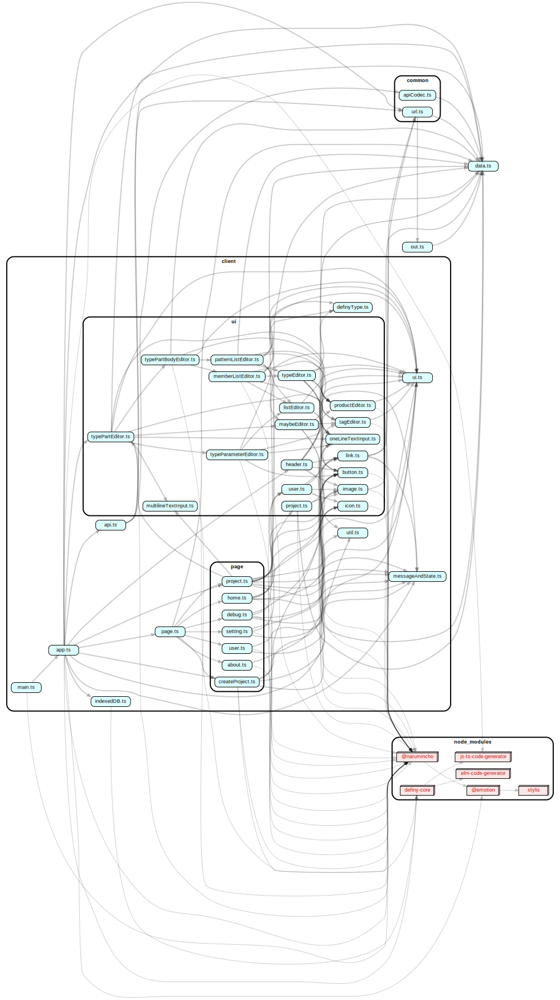

# definy (VSCode 拡張機能版)

[VSCode 拡張機能版 の説明](definyVSCodeExtension.md)

# definy.app (Web アプリ版)

Definy is Web App for Web App.

[Latest Version](https://definy.app/?hl=en)

[Old Version](https://definy-old.web.app/)

ゲームとツールを手軽に作れて公開できるプログラミング言語とエディタ,ゲームエンジン,SNS. [Elm](https://elm-lang.org/)で作っていた時期もあったが, 今は React で作られている Web アプリ. PureScript に移行中. **まだ, ぜんぜんできていない**

[ここ](https://definy.app/?hl=ja)で動作を確認できる

[古いバージョン](https://definy-old.web.app/)では WebAssembly を使って数値の足し算, 引き算, 掛け算ができる

## 特徴

- インストールの必要なく, Web ブラウザで動くため, 開発環境構築に時間がかからない
- Web ブラウザで 動作するので多くの端末, OS で動作する
- Web ブラウザ上のエディタで, プログラムを書く
- 言語仕様がシンプル
- 純粋関数型言語であり, 全てが不変データなため動作が予想しやすい
- エラーは Result 型で表現するため, 実行時エラーがかなり少ない
- 言語機能と結びついた構造化されたバージョン管理システムが付属している
- コードが文字列でなく, AST のような構造化されたデータをコードとして編集するので, 文法エラー, 参照不明のエラーがない
- コード整形ツールが不要
- 式の評価過程をエディタ上で確認できる
- 独自のリテラルを作れる
- 画像や音声, 3D モデルをプリミティブに扱える
- キーコンフィグ機能が自動でつく
- マクロ, TAS 機能, RTA タイマーが使える
- Chrome で, Google 翻訳が使える. 海外のゲームを日本語でできる
- 配信者のゲームの状態を受け取って, そこからゲームを再開できる
- 全てのゲームとツールのコードはプチコン 3 号のようにオープン

## フォルダとファイルの説明

- `/.github/workflows/deploy_firebase.yml`: Firebase へのデプロイの処理が書かれている
- `/.github/workflows/deploy_gen.yml`: npm パッケージ `@narumincho/gen` へのデプロイの処理が書かれている
- `/.github/workflows/pull_request`: Pull Request したときに実行されるテストの処理が書かれている
- `/build`: ビルドのスクリプト
- `/client`: TypeScript で書かれたクライアント用のコード
- `/common`: クライアントとサーバーの共通のコード
- `/core`: コンパイラのような処理が書かれている
- `/functions`: サーバーのコード
- `/gen`: データやコードを生成するプログラムのコード
- `/static`: スタティックなファイルが置かれている
- `/storybook`: UI の見た目や動作を確かめられる, storybook の設定や, ストーリーが書かれている

## エミュレータの起動方法

[Node.js LTS](https://nodejs.org/ja/) と [pnpm](https://pnpm.io/ja/),  Java (Firestore のエミュレータに必要) をインストールする必要がある.

Google でログインするための 鍵を, 1 つ上の階層のファイルに保存し, npm script の `start` を実行するを開発用にアプリが起動する. Ctrl + C キーを押すと エミュレータを停止することができる. VSCode の ゴミ箱ボタンだと, firestore のエミュレータが終了されないので注意. タスクマネージャーの Open JDK Platform binary などのそれっぽいものを停止すれば, firestore のエミュレータを停止させることができる.

## 各ファイルの依存関係

