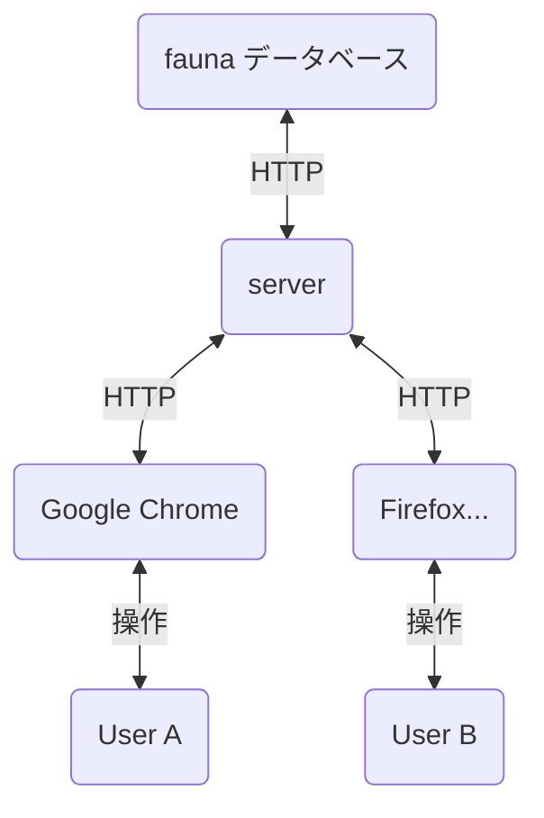
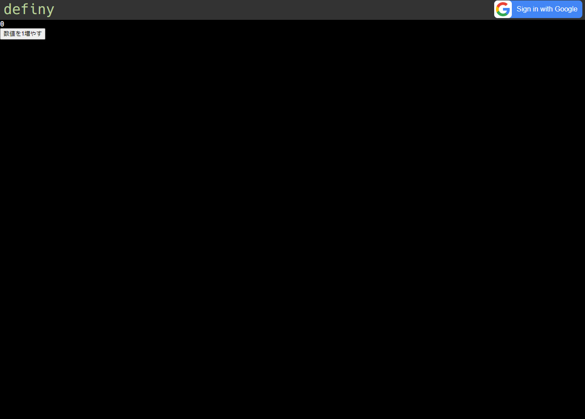

# Deno の TypeScript で書かれた definy



**開発用** がついているコマンドは, このリポジトリをクローンしたあとに

PowerShell, bash などで カレントディレクトリをこの ./README.md が書かれているディレクトリに変更したあとに実行する必要がある

**開発用** がついてないコマンドは, [deno](https://deno.land/) をインストールすれば,
リポジトリをクローンしなくても実行することができる

### **開発用** 全体の型チェックと, deno.lock の生成 (CI環境ではチェック)

```ps1
deno run --allow-run --allow-read ./entryPoints/check.ts
```

## deno 版 definy.app



### **開発用** 起動

```ps1
deno run --check --watch --allow-net=deno.land,:2528,db.us.fauna.com --allow-write=./definyApp/apiClient/ ./entryPoints/definyDev.ts
deno run --check -A ./entryPoints/definyEditorWatchBuild.ts
```

`./entryPoints/definyDev.ts` の内容はこんなような感じ

```ts
import { startDefinyServer } from "../definyApp/server/main.ts";

startDefinyServer({
  mode: { type: "dev", port: 2528 },
  faunaSecret: "...",
  googleLogInClientSecret: "...",
});
```

### 起動

設定のためにTypeScript を書く必要あり

`./server.ts`

```ts
import { startDefinyApiServer } from "https://raw.githubusercontent.com/narumincho/definy/main/deno-lib/definyApp/server/main.ts";

startDefinyApiServer({
  mode: { type: "dev", port: 3000 },
  faunaSecret: "...",
  googleLogInClientSecret: "...",
});
```

PowerShell, bash など

```ps1
deno run --allow-net ./server.ts
```

## definy RPC


### **開発用** サンプルサーバーの起動

```ps1
deno run --check --watch --allow-net=:2520 --allow-write --allow-read ./entryPoints/definyRpcServerDev.ts
```

コード生成をする場合は `--watch` を指定しない

### サンプルサーバーの起動

```ps1
deno run --check --allow-net=:2520 https://raw.githubusercontent.com/narumincho/definy/main/deno-lib/entryPoints/definyRpcServerDenoDeploy.ts
```

### **開発用** definy RPC クライアントビルド

```ps1
deno run --check -A ./entryPoints/definyRpcBuild.ts
```

### **開発用*** definy RPC coreType.ts コード生成

```ps1
deno run --check ./entryPoints/definyRpcCoreGenerate.ts
```

## @definy/node-red

Node RED から definy RPC のサーバーにデータを送信できる (できるようにする) ライブラリ

https://www.npmjs.com/package/@definy/node-red

### **開発用*** Node.js 向けにビルド

```ps1
deno run --check -A ./nodeRed/build.ts
```

### **開発用*** npm に公開

```ps1
cd ./nodeRedPackage && npm publish .
```

### **開発用*** Node RED の起動とデバッグ

```ps1
cd ~/.node-red
node-red
npm install path/to/nodeRedPackage
```
