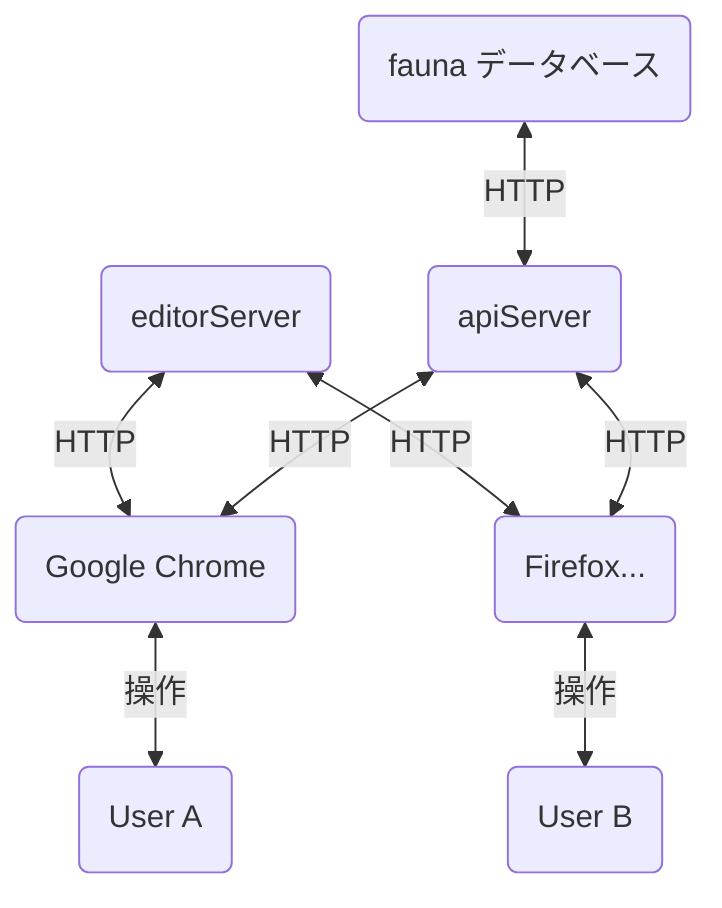

# Deno の TypeScript で書かれた definy



**開発用** がついているコマンドは, このリポジトリをクローンしたあとに

PowerShell, bash などで カレントディレクトリをこの ./README.md が書かれているディレクトリに変更したあとに実行する必要がある

**開発用** がついてないコマンドは, [deno](https://deno.land/) をインストールすれば, リポジトリをクローンしなくても実行することができる

### **開発用** 全体の型チェックと, deno.lock の生成 (CI環境ではチェック) 
```ps1
deno run --allow-run --allow-read ./entryPoints/check.ts
```

## deno 版 definy.app editorServer

### **開発用** editor サーバーを起動

```ps1
deno run --watch --allow-net=:2500,deno.land ./entryPoints/definyAppEditorServerDev.ts
```

### **開発用** editor browser client の watch ビルド

```ps1
deno run --watch -A ./entryPoints/definyAppEditorWatchBuild.ts
```

### editor サーバーを起動

```ps1
deno run --check --allow-net=:8000,deno.land https://raw.githubusercontent.com/narumincho/definy/main/deno-lib/entryPoints/definyAppEditorServerDenoDeploy.ts
```

`deno.land` への接続は [imagescript](https://github.com/matmen/ImageScript) が wasm のダウンロードに使うため必要 (埋め込んでくれれば良いのに...)

### **開発用** editor クライアントスクリプトビルドを起動

```ps1
deno run --check --watch -A ./definyApp/editor/watchBuild.ts
```

## deno 版 definy.app apiServer を起動

設定のためにTypeScript を書く必要あり

`./apiServer.ts`
```ts
import { startDefinyApiServer } from "https://raw.githubusercontent.com/narumincho/definy/main/deno-lib/definyApp/apiServer/main.ts";

startDefinyApiServer({ mode: { type: "denoDeploy" }, faunaSecret: "..." });
```

PowerShell, bash など
```ps1
deno run --allow-net ./apiServer.ts
```

## definy RPC

### **開発用** サンプルサーバーの起動

```ps1
deno run --check --watch --allow-net=:2520 --allow-write --allow-read ./entryPoints/definyRpcServerDev.ts
```

### サンプルサーバーの起動

```ps1
deno run --check --allow-net=:2520 --allow-write --allow-read https://raw.githubusercontent.com/narumincho/definy/main/deno-lib/entryPoints/definyRpcServerDenoDeploy.ts
```

### **開発用** definy RPC クライアントビルド

```ps1
deno run --check --watch -A ./entryPoints/definyRpcBuild.ts
```
