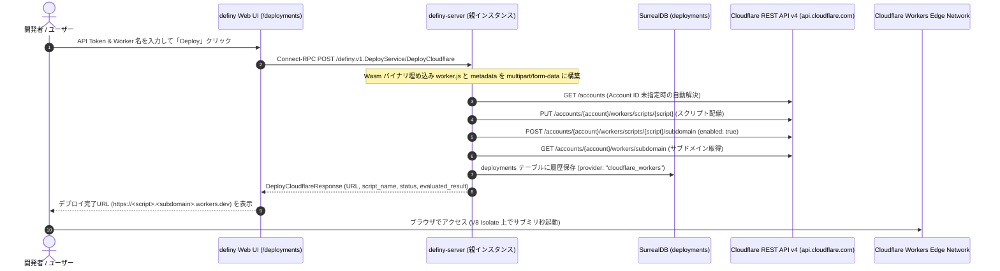

# Cloudflare Workers REST API v4 による運用ブートストラップ (Edge Bootstrapping)

definy では、従来の VM / Docker コンテナ基盤（Fly.io 等）に加えて、**Cloudflare
Workers REST API v4** (`https://api.cloudflare.com/client/v4`)
を直接呼び出すことで、OS やコンテナのオーバーヘッドを排したグローバルエッジ V8
Isolate 環境への自己デプロイ（運用ブートストラップ）をサポートしています。

> **Deno Deploy からの移行について**:\
> Deno チームが Cloudflare に合流し、Deno Deploy が将来的に Cloudflare Workers
> へ移行・集約される方針となったため（参照:
> [Deno + Cloudflare](https://deno.com/blog/cloudflare)）、definy
> のエッジデプロイ基盤も Cloudflare Workers REST API v4 へ正式移行しました。

---

## 1. Cloudflare Workers 採用の背景と優位性

| 観点                   | Fly.io (Docker / Linux VM)                        | Cloudflare Workers (V8 Isolate)                                                                 |
| :--------------------- | :------------------------------------------------ | :---------------------------------------------------------------------------------------------- |
| **実行環境**           | 軽量 Linux VM (Firecracker microVM)               | V8 Isolate (Web 標準エッジランタイム)                                                           |
| **起動オーバーヘッド** | 起動に数秒〜数十秒                                | サブミリ秒〜数ミリ秒 (OS レイヤー完全撤廃)                                                      |
| **成果物の配布方式**   | Docker イメージビルドまたは Wasm ファイル直接注入 | ES Modules (`worker.js`) + Wasm インライン埋め込みを REST API の multipart/form-data で直接送信 |
| **依存技術の少なさ**   | OS, Linux カーネル, Dockerfile, 仮想化層に依存    | **最小の依存** (V8 Isolate と Web 標準 API のみ)                                                |

definy は「純粋な式と能力 (Capability)
による自律的システム」を目指しており、重厚な OS レイヤーが存在しない Cloudflare
Workers は definy の設計思想に最も適合するクラウド実行基盤です。

---

## 2. デプロイフローとアーキテクチャ



---

## 3. Connect-RPC API 仕様

### `definy.v1.DeployService/ListCloudflareWorkers`

#### リクエスト (`ListCloudflareWorkersRequest`)

- `apiToken`: (string, 必須) Cloudflare API Token（Workers Scripts
  の読み取り権限）。
- `accountId`: (string, 任意) Cloudflare Account
  ID（省略時はトークンから自動解決）。

#### レスポンス (`ListCloudflareWorkersResponse`)

- `workers`: アカウント内でアクセス可能な Worker スクリプト一覧 (`id`,
  `createdOn`, `modifiedOn`)。

### `definy.v1.DeployService/DeployCloudflare`

#### リクエスト (`DeployCloudflareRequest`)

- `apiToken`: (string, 必須) Cloudflare API Token（Workers Scripts
  の編集権限）。
- `accountId`: (string, 任意) Cloudflare Account
  ID（省略時はトークンから自動解決）。
- `scriptName`: (string, 任意) デプロイ先の Worker
  スクリプト名（省略時はランダム一意名）。
- `wasmHash`: (string, 任意) エッジワーカーに同梱する仮想 WebAssembly
  バイナリのハッシュ。
- `customScript`: (string, 任意) カスタム `worker.js`
  スクリプト（未指定時はデフォルトの edge runner が利用されます）。
- `compileSelfHosted`: (bool, 任意)
  自己記述コンパイラ検証サンプル（`15 + 27 = 42`）を動的ビルドして配備。
- `partId`: (string, 任意) definy のパーツ ID
  またはパーツ名。指定時は該当パーツの式をオンデマンドで Wasm 化して配備。

#### レスポンス (`DeployCloudflareResponse`)

- `scriptName`: Worker スクリプト名
- `status`: デプロイステータス (`"succeeded"`)
- `url`: デプロイされた Worker のメイン URL
  (`https://<script>.<subdomain>.workers.dev`)
- `evaluatedResult`: 式の評価結果（自己コンパイラやパーツデプロイ時）

---

## 4. UI からの利用方法

1. [Cloudflare ダッシュボード API Tokens (`https://dash.cloudflare.com/profile/api-tokens`)](https://dash.cloudflare.com/profile/api-tokens)
   にて Workers Scripts の編集権限を持つ API Token を発行します。
2. definy のナビゲーションバーから「Deploy」(`/deployments`) 画面を開きます。
3. 「Cloudflare Workers へのデプロイ実行」フォームに API トークンを入力します。
   - ※トークンはリクエスト時のみ使用され、データベースやローカルストレージには保存されません。
4. トークンを入力すると自動的にアクセス可能な Worker 一覧が取得され、
   - **「既存の Worker から選択」**: プルダウンで配備先の Worker
     を選択できます。
   - **「新規 Worker を作成」**: 新しい一意な Worker
     名を入力して新規作成できます。
5. デプロイ対象ソース（カスタム ES Modules、definy
   パーツ、自己コンパイラ検証サンプル、Wasm ハッシュ）を選択します。
6. 「🚀 Deploy to Cloudflare
   Workers」をクリックすると、数秒以内にデプロイが完了し、即座にアクセス可能な
   URL (`https://<script>.<subdomain>.workers.dev`) が表示されます。
7. 過去のデプロイ履歴は下部の「デプロイ履歴一覧」カードに自動的に表示され、プロバイダ（Cloudflare
   Workers / fly.io 等）ごとに確認できます。

---

## 5. cURL による直接呼び出し例

```bash
# Connect-RPC 経由でのデプロイ
curl -X POST https://definy.fly.dev/definy.v1.DeployService/DeployCloudflare \
  -H "Content-Type: application/json" \
  -H "connect-protocol-version: 1" \
  -d '{
    "apiToken": "cf_xxxxxxxxxxxxxxxx",
    "scriptName": "my-definy-edge"
  }'
```

---

## 6. Cloudflare Workers REST API v4 運用の技術知見

1. **multipart/form-data によるスクリプト送信**:
   - `PUT /accounts/{account_id}/workers/scripts/{script_name}` では、`metadata`
     パート（`{"main_module": "worker.js"}`）と `worker.js`（ES Modules
     形式）を含むマルチパート形式でアップロードします。
2. **Account ID の自動解決**:
   - Cloudflare API はほとんどのエンドポイントで `account_id`
     を要求しますが、`GET /accounts` を叩くことで API トークンに紐づくアカウント
     ID を動的に解決可能です。definy-server
     ではユーザーの指定がない場合、自動で初手解決を行います。
3. **`workers.dev` サブドメインの有効化と URL 導出**:
   - スクリプトをアップロードしただけでは `workers.dev`
     経由での外部アクセスが無効な場合があります。配備後に
     `POST /accounts/{account_id}/workers/scripts/{script_name}/subdomain` に
     `{"enabled": true}` を送信することで即時有効化します。
   - アカウントの共有サブドメインは
     `GET /accounts/{account_id}/workers/subdomain`
     で取得でき、`https://{script_name}.{subdomain}.workers.dev`
     として決定的に解決されます。
