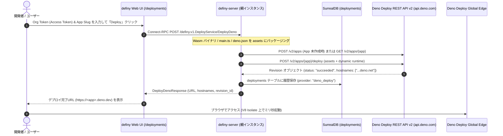

# Deno Deploy REST API v2 による運用ブートストラップ (Edge Bootstrapping)

definy では、従来の VM / Docker コンテナ基盤（Fly.io 等）に加えて、**Deno Deploy REST API v2** (`https://api.deno.com/v2/docs`) を直接呼び出すことで、OS やコンテナのオーバーヘッドを排したエッジ Isolate 環境への自己デプロイ（運用ブートストラップ）をサポートしています。

---

## 1. Deno Deploy 採用の背景と優位性

| 観点 | Fly.io (Docker / Linux VM) | Deno Deploy (V8 Isolate) |
| :--- | :--- | :--- |
| **実行環境** | 軽量 Linux VM (Firecracker microVM) | V8 Isolate (Web 標準ランタイム) |
| **起動オーバーヘッド** | 起動に数秒〜数十秒 | ミリ秒オーダー (OS レイヤーなし) |
| **成果物の配布方式** | Docker イメージビルドまたは Wasm ファイル直接注入 | TypeScript/JavaScript ソース + Wasm ファイルを REST API の `assets` に直接インライン送信 |
| **依存技術の少なさ** | OS, Linux カーネル, Dockerfile, 仮想化層に依存 | **最小の依存** (V8 Isolate と Web 標準 API のみ) |

definy は「純粋な式と能力 (Capability) による自律的システム」を目指しており、重厚な OS レイヤーが存在しない Deno Deploy は definy の設計思想に最も適合するクラウド実行基盤です。

---

## 2. デプロイフローとアーキテクチャ



---

## 3. Connect-RPC API 仕様

### `definy.v1.DeployService/DeployDeno`

#### リクエスト (`DeployDenoRequest`)
- `orgToken`: (string, 必須) Deno Deploy の Organization Access Token または Personal Access Token。
- `appSlug`: (string, 任意) デプロイ先の App Slug（未指定時は自動生成）。
- `wasmHash`: (string, 任意) エッジランタイムに同梱する仮想 WebAssembly バイナリのハッシュ。
- `customScript`: (string, 任意) カスタム `main.ts` スクリプト（未指定時はデフォルトの edge runner が利用されます）。

#### レスポンス (`DeployDenoResponse`)
- `appId`: Deno Deploy 上の App ID (UUID)
- `appSlug`: App Slug
- `revisionId`: 作成された Revision ID (UUID)
- `status`: デプロイステータス (`"succeeded"`, `"queued"`, `"building"`)
- `url`: デプロイされたインスタンスのメイン URL (`https://...deno.net` または `https://<slug>.deno.dev`)
- `hostnames`: ルーティング可能なホスト名一覧

---

## 4. UI からの利用方法

1. `https://dash.deno.com/account#access-tokens` にて Access Token を発行します。
2. definy のナビゲーションバーから「Deploy」(`/deployments`) 画面を開きます。
3. 「Deno Deploy エッジへのデプロイ実行」フォームにトークンを入力します。
   - ※トークンはリクエスト時のみ使用され、データベースやローカルストレージには保存されません。
4. （任意）App Slug や同梱する Wasm ハッシュを入力します。
5. 「🚀 Deploy to Deno Deploy」をクリックすると、数秒以内にデプロイが完了し、即座にアクセス可能な URL が表示されます。
6. 過去のデプロイ履歴は下部の「デプロイ履歴一覧」カードに自動的に表示され、プロバイダ（Deno Deploy / fly.io）ごとに確認できます。

---

## 5. cURL による直接呼び出し例

```bash
# Connect-RPC 経由でのデプロイ
curl -X POST https://definy.fly.dev/definy.v1.DeployService/DeployDeno \
  -H "Content-Type: application/json" \
  -H "connect-protocol-version: 1" \
  -d '{
    "orgToken": "ddp_xxxxxxxxxxxxxxxx",
    "appSlug": "my-definy-edge"
  }'
```
