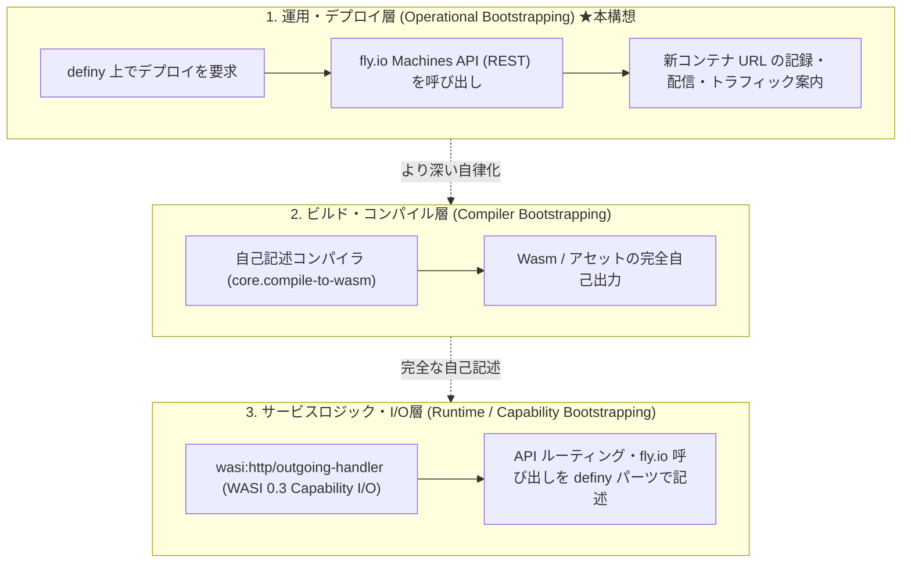
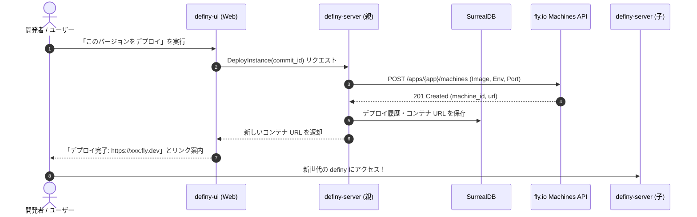

# definy のデプロイ・ブートストラップ構想 (Deployment Bootstrapping via fly.io)

definy サーバー自身が [fly.io](https://fly.io/)
に対してデプロイリクエスト（Machines API 呼び出し）を発行し、
起動した新しいコンテナの URL をクライアントや利用者に配信・案内することで、
開発環境および運用のライフサイクルを自己完結させる **「運用層のブートストラップ
(Operational Bootstrapping)」** の設計とロードマップ。

---

## 1. 概要とブートストラップの位置づけ

「ブートストラップ（Bootstrapping）」には複数の階層が存在します。
本構想は、ローカル環境のターミナルや CLI ツール（`git push` や
`flyctl deploy`）に頼ることなく、 **「definy 自身が definy
の次世代インスタンスをクラウド上にプロビジョニングし、その URL
へ利用者を誘導する」** という
閉ループ（自己複製・世代交代サイクル）を完成させることを目指します。

### ブートストラップの3階層モデル

1. **運用・デプロイ層 (Operational Bootstrapping)**:
   - definy 画面から「definy の最新版」を fly.io にデプロイし、その URL
     にアクセスして次世代の definy が動く。
   - これが実現した時点で、開発者がターミナルを叩いてデプロイする必要がなくなるため、**プラットフォームとしてのブートストラップ（Stage
     1）** と呼ぶことができます。
2. **ビルド・コンパイル層 (Compiler Bootstrapping)**:
   - デプロイされる成果物（Wasm 等）が、Rust の `cargo` ではなく、definy
     内の自己記述コンパイラ（`core.compile-to-wasm`）によって生成される段階（詳細は
     [self-hosting.md](self-hosting.md) 参照）。
3. **サービスロジック・I/O層 (Runtime / Capability Bootstrapping)**:
   - fly.io API への HTTP
     リクエストやルーティング処理自体が、[wasi-capability-io.md](wasi-capability-io.md)
     に基づく Capability レコード注入型パーツとして definy 内で記述される段階。

---

## 2. アーキテクチャと相性

### なぜ fly.io なのか？

1. **Machines API (REST API) による完全プログラマブルな制御**:
   - fly.io は CLI (`flyctl`) を使わなくても、標準的な HTTPS
     リクエスト（`https://api.machines.dev/v1/apps/{app}/machines`）だけでコンテナ（Machine）の作成・起動・停止・破棄が完結します。
   - API トークン（`FLY_API_TOKEN`）を保持した definy サーバーから直接 HTTP
     リクエストを送信可能です。
2. **コンテンツ指向（Content-addressed）との親和性**:
   - definy のコミットは不変のハッシュ値を持ちます。
   - コミットごとに独立したマシンを立ち上げ、`https://definy-<hash>.fly.dev`
     のような**バージョン固定の不変インスタンス URL**
     を安全に生成・配信できます。
3. **WASI Capability I/O への移行容易性**:
   - 外部 HTTP 通信は、将来的に `wasi:http/outgoing-handler` として definy
     言語内に自然に能力注入できます。

---

## 3. デプロイフロー

---

## 4. 次にすべきこと (実装ロードマップ)

運用ブートストラップを実現するために、順を追って取り組むべきタスク一覧です：

### Step 1: fly.io Machines API の疎通・動作検証 (最小プロトタイプ)

- [x] `FLY_API_TOKEN` および `FLY_APP_NAME` を `definy-server`
      の環境変数として定義・読み込み可能にする (`fly_machines::FlyConfig`)。
- [x] Rust コード内 (`definy-server/src/fly_machines.rs`) から fly.io Machines
      API クライアント (`FlyMachineClient`)
      を実装し、マシンのリスト取得・作成・停止・破棄およびモック検証テストを完了。
- [x] 実環境疎通用のライブテスト (`test_live_fly_machines_api`) を追加。

### Step 2: デプロイ実行用の RPC / エンドポイント新設

- [ ] Connect-RPC または内部 API に `DeployInstance` メソッドを追加。
- [ ] リクエストパラメータ（対象のコミットハッシュ、起動設定など）を定義。
- [ ] サーバー側で Machines API の `create machine` を呼び出す処理を実装。

### Step 3: デプロイ済みコンテナ URL の永続化と UI 案内

- [ ] デプロイしたマシンの状態（`machine_id`, `url`, `commit_hash`, `status`,
      `created_at`）を SurrealDB に保存するスキーマを追加。
- [ ] `definy-ui`
      上にデプロイ状況一覧と、新インスタンスへの遷移リンクを表示するコンポーネントを作成。

### Step 4: Docker イメージの供給方針の策定

- 起動するコンテナの Docker イメージをどう提供するか決定・構築する：
  - **方針A (短期・現実的)**: GitHub Actions でビルドした Docker イメージを
    GitHub Container Registry (GHCR) または Fly Registry に push
    し、タグ（コミットハッシュ）を指定して起動する。
  - **方針B (中期)**: Docker Remote Build API や Fly
    のリモートビルダーを利用して、definy-server から直接ビルドを要求する。

### Step 5: WASI 0.3 Capability I/O との統合 (自己記述化)

- [ ] [wasi-capability-io.md](wasi-capability-io.md) に基づき、Machines API
      を呼び出すロジックを definy の式（`Expression`）およびパーツとして再定義。
- [ ] definy
      言語自身が「自分自身の新しいインスタンスをデプロイする」完全な自己記述コードとして動作させる。
