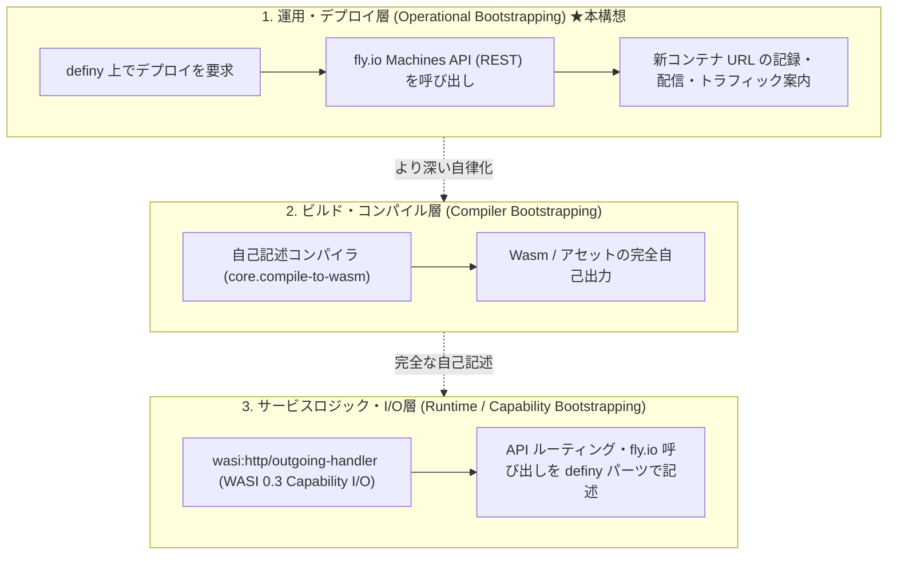
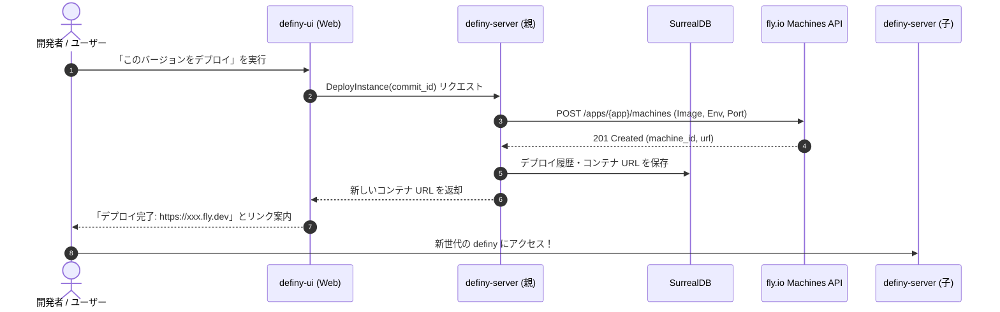
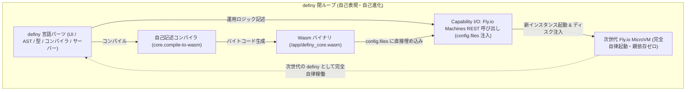

# definy のデプロイ・ブートストラップ構想 (Deployment Bootstrapping via fly.io)

definy サーバー自身が [fly.io](https://fly.io/)
に対してデプロイリクエスト（Machines API 呼び出し）を発行し、
起動した新しいコンテナの URL をクライアントや利用者に配信・案内することで、
開発環境および運用のライフサイクルを自己完結させる **「運用層のブートストラップ
(Operational Bootstrapping)」** の設計とロードマップ。

---

## 1. 概要とブートストラップの位置づけ

「ブートストラップ（Bootstrapping）」には複数の階層が存在します。
本構想は、ローカル環境のターミナルや CLI ツール（`git push` や
`flyctl deploy`）に頼ることなく、 **「definy 自身が definy
の次世代インスタンスをクラウド上にプロビジョニングし、その URL
へ利用者を誘導する」** という
閉ループ（自己複製・世代交代サイクル）を完成させることを目指します。

### ブートストラップの3階層モデル

1. **運用・デプロイ層 (Operational Bootstrapping)**:
   - definy 画面から「definy の最新版」を fly.io にデプロイし、その URL
     にアクセスして次世代の definy が動く。
   - これが実現した時点で、開発者がターミナルを叩いてデプロイする必要がなくなるため、**プラットフォームとしてのブートストラップ（Stage
     1）** と呼ぶことができます。
2. **ビルド・コンパイル層 (Compiler Bootstrapping)**:
   - デプロイされる成果物（Wasm 等）が、Rust の `cargo` ではなく、definy
     内の自己記述コンパイラ（`core.compile-to-wasm`）によって生成される段階（詳細は
     [self-hosting.md](self-hosting.md) 参照）。
3. **サービスロジック・I/O層 (Runtime / Capability Bootstrapping)**:
   - fly.io API への HTTP
     リクエストやルーティング処理自体が、[wasi-capability-io.md](wasi-capability-io.md)
     に基づく Capability レコード注入型パーツとして definy 内で記述される段階。

---

## 2. アーキテクチャと相性

### なぜ fly.io なのか？

1. **Machines API (REST API) による完全プログラマブルな制御**:
   - fly.io は CLI (`flyctl`) を使わなくても、標準的な HTTPS
     リクエスト（`https://api.machines.dev/v1/apps/{app}/machines`）だけでコンテナ（Machine）の作成・起動・停止・破棄が完結します。
   - API トークン（`FLY_API_TOKEN`）を保持した definy サーバーから直接 HTTP
     リクエストを送信可能です。
2. **コンテンツ指向（Content-addressed）との親和性**:
   - definy のコミットは不変のハッシュ値を持ちます。
   - コミットごとに独立したマシンを立ち上げ、`https://definy-<hash>.fly.dev`
     のような**バージョン固定の不変インスタンス URL**
     を安全に生成・配信できます。
3. **WASI Capability I/O への移行容易性**:
   - 外部 HTTP 通信は、将来的に `wasi:http/outgoing-handler` として definy
     言語内に自然に能力注入できます。

---

## 3. デプロイフロー

---

## 4. 次にすべきこと (実装ロードマップ)

運用ブートストラップを実現するために、順を追って取り組むべきタスク一覧です：

### Step 1: fly.io Machines API の疎通・動作検証 (最小プロトタイプ)

- [x] `FLY_API_TOKEN` および `FLY_APP_NAME` を `definy-server`
      の環境変数として定義・読み込み可能にする (`fly_machines::FlyConfig`)。
- [x] Rust コード内 (`definy-server/src/fly_machines.rs`) から fly.io Machines
      API クライアント (`FlyMachineClient`)
      を実装し、マシンのリスト取得・作成・停止・破棄およびモック検証テストを完了。
- [x] 実環境疎通用のライブテスト (`test_live_fly_machines_api`) を追加。

### Step 2: デプロイ実行用の RPC / エンドポイント新設

- [x] Protocol Buffers (`proto/definy/v1/deploy.proto`) および
      `definy-event/src/rpc.rs` に `DeployService` (`DeployInstance`,
      `GetDeployStatus`) のインターフェースとメッセージ型を定義。
- [x] Connect-RPC ハンドラ (`handle_deploy_instance`,
      `handle_get_deploy_status`) を `definy-server/src/connect_rpc.rs`
      に実装し、OpenAPI (`ApiDoc`) に統合。
- [x] モック fly.io Machines API と Connect-RPC を結合した E2E テスト
      (`test_connect_rpc_deploy_service_success`) を完了。

### Step 3: デプロイ済みコンテナ URL の永続化と UI 案内

- [x] デプロイしたマシンの状態（`machine_id`, `url`, `commit_hash`, `status`,
      `created_at`）を SurrealDB に保存するスキーマ (`schema.surql`) および DB
      アクセス関数 (`db::save_deployment`, `db::get_deployments`,
      `db::get_deployment`) を追加。
- [x] `DeployService` に `ListDeployments` RPC を追加し、Connect-RPC
      経由でデプロイ履歴一覧を取得可能に実装。
- [x] `definy-ui` 上に `/deployments` 画面（`DeploymentsView`
      コンポーネント）を新設し、 ブートストラップ3階層の説明、Connect-RPC
      呼び出し cURL 例、稼働中インスタンスへの案内リンクを統合。

### Step 4: 仮想ファイル配信と汎用 WASI ランタイム (wasmtime) による自己完結デプロイ

- Docker イメージをコミットごとに都度ビルド・push する方式を廃止。
- **外部依存を「wasmtime などの汎用 WASI 実行バイナリ」1つに絞り込み、他は
  definy サーバー内で完結させる**（詳細は
  [wasm-virtual-deployment.md](wasm-virtual-deployment.md) 参照）：
  - [x] `definy-server` に仮想 Wasm
        ファイル配信エンドポイント（`GET /virtual/wasm/{hash}`）を実装
        (`virtual_file.rs`)。
  - [x] 外部から一度だけ取得した汎用 WASI ランタイム（Alpine + wasmtime
        等）が起動時に仮想 Wasm を取得して `wasmtime serve` で動く基盤を定義
        (`runner/`)。
  - [x] fly.io Machines API 呼び出し時に仮想 Wasm
        のハッシュを環境変数として渡し、Docker
        ビルドなしでミリ秒〜数秒での高速デプロイを実現
        (`handle_deploy_instance`)。

### Step 5: WASI 0.3 Capability I/O との統合 (自己記述化)

- [ ] [wasi-capability-io.md](wasi-capability-io.md) に基づき、Machines API
      を呼び出すロジックを definy の式（`Expression`）およびパーツとして再定義。
- [ ] definy
      言語自身が「自分自身の新しいインスタンスをデプロイする」完全な自己記述コードとして動作させる。

---

## 5. Fly.io to Fly.io 自己デプロイと完全な自己表現 (Self-Hosting Loop)

### 「definy で definy を表現する」とはどういうことか？

プログラミング言語・開発プラットフォームの歴史において、最も重要なマイルストーンが「セルフホスティング（自己記述・ブートストラップ）」です。
definy
におけるブートストラップとは、単にコンパイラが自言語で書かれていることにとどまらず、**「UI、AST・型検査、コンパイラ、HTTP
配信、そしてクラウドへの自己プロビジョニング運用に至るすべてのライフサイクルが
definy 言語のパーツとして記述され、definy 自身が次世代の definy
をデプロイして世代交代する」** という完全な閉ループを意味します。

### Fly.io to Fly.io 自己デプロイの動作ステップ

稼働中の definy サーバー（親）から新しい definy
サーバー（子）を起動する流れは以下の通りです：

1. **デプロイ要求の受付**:
   - ユーザーまたはクライアントが親サーバーに対し
     `DeployInstance(wasm_hash, region: "nrt")` RPC を送信。
2. **SurrealDB へのメタデータ記録**:
   - 親サーバーは対象ハッシュ、要求日時、ステータスを `deployments`
     テーブルに保存。
3. **親サーバーが Fly.io Machines REST API を直接呼び出し
   (デプロイ時直接注入)**:
   - ターミナルや外部 CI を一切介さず、親サーバーが内部環境変数 `FLY_API_TOKEN`
     を用いて `POST https://api.machines.dev/v1/apps/{app}/machines` を発行。
   - `config.files` に Wasm バイナリを Base64
     エンコードして埋め込み（`guest_path: /app/definy_core.wasm`）。環境変数として
     `WASM_FILE=/app/definy_core.wasm` を注入。
4. **Fly.io が Firecracker MicroVM を瞬時にプロビジョニング (201 Created)**:
   - Wasm バイナリがディスクに配置された状態で MicroVM
     が起動。数秒以内に新しい子マシンの ID および URL（例:
     `https://definy-<id>.fly.dev`）が確定。
5. **子マシンが注入されたローカルディスクから即座に起動
   (親への起動時通信ゼロ)**:
   - 子マシン内の汎用 WASI
     ランナーが起動し、ネットワーク経由のダウンロードを一切行うことなく、ローカルに注入された
     `/app/definy_core.wasm` を使って即座に `wasmtime serve`
     を開始。親サーバーが直後に停止しても 100% 自律起動可能。
6. **新世代へのトラフィック案内（世代交代）**:
   - 親サーバーがクライアントへ子マシンの URL を返却し、ユーザーは次世代の
     definy へとスムーズに移行。

### ブートストラップ完了時の姿

| 階層                          | 現在の実装 (Rust / Axum / Dioxus)               | ブートストラップ完成時の姿 (definy 言語)                     |
| :---------------------------- | :---------------------------------------------- | :----------------------------------------------------------- |
| **運用層 (Layer 1)**          | `fly_machines.rs` (reqwest による REST 呼出)    | definy の純粋パーツ式（Machines API 呼出パーツ）             |
| **ビルド層 (Layer 2)**        | `cargo build`, `dx build` (Rust ツールチェイン) | `core.compile-to-wasm` (definy で書かれた自己記述コンパイラ) |
| **I/O・サーバー層 (Layer 3)** | `axum`, `tokio` (Rust 非同期ランタイム)         | `wasi:http/outgoing-handler` Capability 注入パーツ           |
| **UI・エディタ層**            | Rust Dioxus コンポーネント (`definy-ui`)        | definy の UI 表現パーツ・ツリーレイアウト                    |

この 4 階層がすべて definy の式・パーツとして表現された時、definy
は外部のあらゆる開発環境（Rust, Cargo, Docker, GitHub Actions,
ローカルターミナル）から完全に独立し、**「definy で書かれた definy
が、クラウド上で自分自身の次の世代を生み出し続ける」**
という究極の自己ホスティングが達成されます。

現在、この完全なシーケンスは definy UI の `/deployments` 画面の「3. Fly.io
自己デプロイ
(運用ブートストラップ)」タブにて多言語で視覚的に閲覧できるようになっています。
