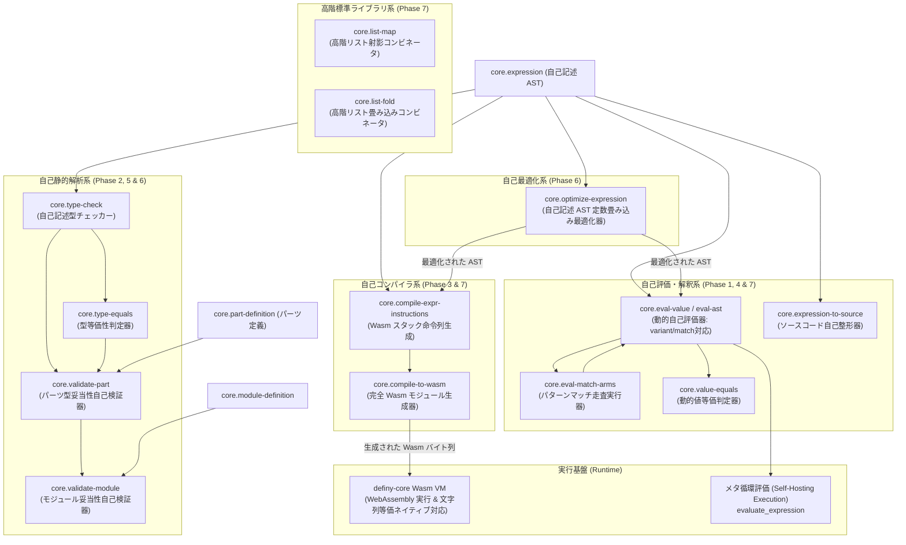

# definy のセルフホスト構想 (Self-Hosting)

definy を definy
自身の言語仕様・データ構造・評価器を用いて表現し、自己記述・自己検証可能にするための設計と実装仕様。

## 概要

definy
は、構文木（AST）、型システム、パーツやモジュールのメタデータ、そしてそれらの評価器・型チェッカー・コンパイラを
definy
の純粋なデータ構造および式（`Expression`）として自己記述できるセルフホスト環境を実現しています。

これにより、以下の利点が得られます：

1. **コンパイラ・評価器の完全自己完結**:
   外部言語（Rustなど）の変更なしに、definy 言語自体の新機能や最適化を definy
   内で記述・検証可能。
2. **決定論的かつコンテンツ指向の言語定義**: 式や型、モジュール構造自体が
   SHA-256 / Ed25519
   によるコンテンツ指向ハッシュで管理され、バージョンロックと不変性が保証される。
3. **安全なマクロ・メタプログラミング**:
   式をデータとして受け取り、式を返す関数を通常パーツとして安全に定義可能。
4. **自己ホスト WebAssembly 生成**: definy 式から WebAssembly
   バイナリを直接生成でき、外部コンパイラなしでネイティブ/ブラウザ実行可能。

### 実サービスとの接続状況

セルフホスト部品の実行テストは、Definy AST で記述した関数を Rust の
`definy-core` 実行基盤上で動かす検証です。Definy
サービス全体のブートストラップが完了したことを意味しません。

- `core.type-check`
  は、数値・文字列・真偽値、基本演算、変数、条件分岐、`let`、レコード構築（`record`）、フィールドアクセス（`record_get`）、型環境上の関数適用を扱います。
  宣言型を与える `core.type-check-against`
  は関数引数を型環境へ束縛して関数本体を検査します。 lambda
  はパーツ宣言型が要求する関数形に沿う位置か、関数型 parameter への Call
  引数でのみ受け入れます。 lambda を callee
  とする即時適用や、期待関数型のない位置の lambda は拒否します。
  `ModulePartEntry.part_type` はパーツ直下の宣言 metadata であり、式の中に置く型
  marker ではありません。 リスト式やパーツ参照の検査は未対応です。
  `core.type-equals` は基本型・リスト型・関数型・record 型を再帰比較します。
  union 型も variant の順序と optional payload 型を含めて比較し、reference 型は
  part hash で比較します。 record/union は定義順を含めて比較します。
- `PartType::Type` は自己ホスト `type-ast` の kind `type`
  として扱います。通常の投稿経路では `TypeNumber` / `TypeString` / `TypeBoolean`
  と inline な `TypeList` / `TypeFunction` / `TypeLiteral` / `TypeUnion`
  宣言を検証できます。別パーツを参照する type declaration は module type
  environment がないため、引き続き拒否します。現状は adapter が各 inline node
  を再帰変換し、 self-host checker が root の kind `type`
  を確認します。field/tag の重複などの意味検査は未完了です。
- Connect-RPC の `SubmitEvent` は、`ModuleCommitEvent` を `module-definition`
  値へ変換し、 `core.validate-module`
  で検証してから保存します。式や型の変換に失敗した場合、または
  型チェッカーが拒否した場合は `400` を返します。
- 現段階ではリスト・直和型構築・他パーツ参照などを網羅的に型検査できません。
  型チェッカーの入力表現や環境が未対応のため、これらを含む有効なモジュールも
  fail-closed で拒否される場合があります。

一般的なモジュールを受け入れる次のブロッカーは、module 内外の part reference
を解決する型環境と、 リスト・構築子・パターンマッチを含む式検査です。

Content-addressed storage は同一 hash・同一 bytes の再保存を成功扱いし、hash
衝突や既存 bytes と異なる内容は拒否します。ModuleCommit
に同じ式が複数回現れても、投稿再試行が CAS 重複で失敗しません。

#### Lambda の配置規則

関数値を作る `function` 式は、期待する `PartType::Function`
に対応する場所だけで有効です。 これはパーツ定義直下の関数本体（curried function
は宣言された関数戻り値型に沿って束ねる）と、 関数型 parameter を受け取る Call
引数です。`((x) => ...)(arg)` のように lambda 自体を callee
にする即時適用は許可しません。関数の呼び出し先はパーツ参照または型環境上の変数にします。

`number` などのパーツ形状も式 node ではなく、パーツ定義の `part_type` metadata
に宣言します。 その宣言型が式 root の期待型になり、`core.validate-part`
が式全体を検査します。

### 今後の実装方針

以下の順で、通常の module 投稿を自己ホスト検証の対象へ広げます。

1. **型宣言の意味検査**: record field 名と union tag の重複、空 variant
   集合、再帰参照の規則を決め、 converter と self-host validator
   のテストを追加します。現状は別 part reference を含む型宣言を拒否します。
2. **module type environment**: `ModuleCommitEvent` の全 part 名/hash
   と宣言型から環境を作り、
   `PartReference`・構築子・相互参照を解決します。循環参照は明示的に検出し、無制限再帰を避けます。
3. **式検査の拡張**: list/record の構築と field access、union constructor、match
   の網羅性を `core.type-check` に追加します。self-host checker と UI
   diagnostics の共有ケースを conformance test します。
4. **bootstrap の固定**: Rust migration が生成する core definitions を versioned
   seed として固定し、 空 DB から同じ hash の core が再構築できることを CI
   で検証します。
5. **compiler bootstrap**: 対象言語を段階的に広げ、Rust stage0 から Definy
   compiler stage1 を作り、 stage1 が同一 compiler と test suite
   を再生成できるか比較します。
6. **service host 境界**: 最後に HTTP、database、署名、永続 event log を
   capability-limited host API として公開し、 サーバーの純粋な業務ロジックから
   Definy へ移します（WASI 0.3 スタイルの能力注入設計仕様は
   [wasi-capability-io.md](file:///Users/narumi/Documents/GitHub/definy/docs/wasi-capability-io.md)
   を参照）。IO を持つサービス全体の移行は言語 runtime の拡張後です。

### セルフホスティング全体アーキテクチャ



---

## セルフホストのロードマップと到達状況

- [x] **Phase 1: 完全動的値評価器 (Self-Evaluating Interpreter)**
  - 動的値型 `core.value`、変数環境型 `core.env`、環境探索
    `core.env-lookup`、環境拡張 `core.env-extend`
  - 完全動的値自己評価器 `core.eval-value`: `expression -> env -> value`
- [x] **Phase 2: 自己記述型チェッカー (Self-Hosted Type Checker)**
  - 型エラー型 `core.type-error`、型検査結果型 `core.type-result`、型環境
    `core.type-env`
  - 型等価性判定 `core.type-equals`
  - 静的型検査器 `core.type-check`: `expression -> type-env -> type-result`
  - `core.type-check-against` による宣言型ベースの lambda 検査と inline type
    declaration の kind 検証
- [x] **Phase 3: 自己ホスト WebAssembly コンパイラ (Self-Hosted Wasm Compiler)**
  - 式スタック命令列コンパイラ `core.compile-expr-instructions`:
    `expression -> list<number>`
  - 完全 WebAssembly バイナリ生成器 `core.compile-to-wasm`:
    `expression -> list<number>`
  - definy の Wasm VM による即時実行・検証を実証完了
- [x] **Phase 4: 自己記述フォーマッター・メタ循環評価 (Self-Hosted Formatter &
      Meta-Circular Execution)**
  - 自己記述コード整形器 `core.expression-to-source`: `expression -> string`
  - 構文拡張: `let`, `not`, `and`, `or` の完全自己評価 (`core.eval-value`) &
    型検査 (`core.type-check`)
- [x] **Phase 5: パーツ自己検証器 & 完全自己ホストコンパイル実証
      (Self-Validation & End-to-End Compiler Execution)**
  - パーツ妥当性自己検証器 `core.validate-part`: `part-definition -> boolean`
  - Wasm 命令列コンパイラ `core.compile-expr-instructions` の論理演算（`not`,
    `and`, `or`）対応
  - 自己記述コンパイラ `core.compile-to-wasm` による Wasm
    生成・即時実行の実証完了
  - 汎用自己評価器 `core.eval-value`、自己型チェッカー
    `core.type-check`、自己バリデータ `core.validate-part` のメタ循環実証完了
- [x] **Phase 6: 自己記述 AST 最適化器 & モジュール全体自己検証 (Self-Hosted
      Optimizer & Module Validation)**
  - 自己記述 AST 最適化器 `core.optimize-expression`: `expression -> expression`
    - 定数畳み込み（Constant Folding: 算術演算、論理否定、条件分岐の枝刈り）
    - 最適化された AST からの Wasm 生成 & 即時実行実証完了
  - モジュール妥当性自己検証器 `core.validate-module`:
    `module-definition -> boolean`
    - モジュール名検証（非空文字チェック）および全パーツの型妥当性の網羅検証実証完了
- [x] **Phase 7: 直和型・パターンマッチ自己評価 & 動的等価判定 &
      高階コレクションコンビネータ (Self-Hosted ADT Pattern Matching &
      Collections)**
  - Wasm コンパイラでのディープ文字列等価比較ネイティブ対応（`Expression::Equal`
    / `Expression::NotEqual` で Tag 2: String のバイト列比較ディスパッチ）
  - 動的値等価性自己判定器 `core.value-equals`: `value -> value -> boolean`
  - 直和型構築 `variant` 式の自己解釈実行（`core.eval-value`）
  - パターンマッチ `match` 式の完全自己解釈実行（`core.eval-match-arms`,
    `core.eval-match-arms-inner`
    による先頭からの線形マッチと拡張環境上での本体評価）
  - 高階リスト操作コンビネータ `core.list-map`:
    `(a -> b) -> list<a> -> list<b>`、`core.list-fold`:
    `(b -> a -> b) -> b -> list<a> -> b`
  - メタ循環パターンマッチ実行および高階リスト処理の実行実証完了
- [x] **Phase 8: レコード構築・フィールドアクセスの自己ホスト型検査 &
      自己評価拡張 (Self-Hosted Record & Field Access)**
  - 型エラー型 `core.type-error` に `not_a_record`, `field_not_found` を追加
  - レコードフィールド型探索 `core.record-field-type-lookup`
    およびレコード型検査器 `core.type-check-record-fields` を新設
  - 静的型検査器 `core.type-check` に `record`（レコードリテラル）および
    `record_get`（フィールドアクセス）の型検査アームを追加
  - 動的値型 `core.value` に
    `record(value: list<{ key: string, value: value }>)` を追加
  - 動的フィールド値探索 `core.record-field-lookup` およびレコード動的評価器
    `core.eval-record-fields` を新設
  - 完全動的値評価器 `core.eval-value` に `record` リテラルの評価および
    `record_get` によるフィールド値アクセスの評価アームを追加
  - 動的等価判定器 `core.value-equals` に `core.value-equals-record-fields`
    を追加し、動的レコード同士の順序依存・キー/値再帰等価比較に対応
  - Wasm コンパイラ `emit_match_arms` におけるワイルドカード `_`
    の無条件マッチ対応
  - レコード式の型検査・動的自己評価・動的等価判定およびパーツ妥当性検証（`core.validate-part`）のメタ循環実証完了
- [x] **Phase 9: 直和型（Union）・パターンマッチ（Match）の自己ホスト型検査 &
      網羅性検証 (Self-Hosted Union Variants & Pattern Match Type Checking)**
  - 型エラー型 `core.type-error` に `not_a_union`, `variant_not_found`,
    `non_exhaustive_match` を追加
  - 直和型探索・検証パーツ群（`builtin_type_checker/union_lookup.rs`）を新設
    - `core.union-variant-type-lookup`:
      直和型から指定タグのペイロード型を線形探索（引数なし variant は `{}`
      レコード型として統一）
    - `core.find-tag-in-arms`: マッチアーム一覧に対象タグが含まれるかを線形探索
    - `core.check-union-exhaustiveness`:
      直和型の全タグがマッチアームに網羅されているかを検証し、欠落時に
      `non_exhaustive_match` を返却
    - `core.type-assignable-union-variants`:
      直和型の双対的幅サブタイピング（$Actual \subseteq Expected$）を再帰検証
  - パターンマッチ型検査パーツ群（`builtin_type_checker/union_check.rs`）を新設
    - `core.type-check-match-arms-inner`:
      各アームの環境拡張、本体型検査、戻り値型一致検証（初出アーム型との
      `type-assignable`）、全走査完了後の網羅性検査の呼び出し
    - `core.type-check-match-arms`: パターンマッチ型検査のエントリーポイント
  - 静的型検査器 `core.type-check` に `variant`（直和型値の生成・型推論）および
    `match`（パターンマッチ式）の型検査アームを追加
  - 型代入適合性検査器 `core.type-assignable`
    に直和型同士の部分型関係（サブタイピング）検証を追加
  - 1000行ルールに基づき `union_lookup.rs` と `union_check.rs` に責務を分離
  - 単体バリアント推論、双対的サブタイピング代入、全アーム型一致、網羅性欠落エラー検出、未知バリアントエラー検出のメタ循環実証完了

---

## セルフホスト用ビルトインパーツ (`core` モジュール)

### Phase 1: 動的値・環境と完全評価器

#### 1. 動的値型: `core.value`

ランタイム実行時の動的値を表現する直和型（Union Type）。

- `number(value: number)`: 数値
- `string(value: string)`: 文字列
- `boolean(value: boolean)`: 真偽値
- `list(value: list<value>)`: リスト値
- `closure({ parameter_id: number, body: expression, captured_env: env })`:
  レキシカルスコープを保持する関数クロージャ
- `variant({ tag: string, payload: value })`: タグ付き直和型値
- `unit`: 空値

#### 2. 変数環境型 & 補助関数: `core.env`, `core.env-lookup`, `core.env-extend`

- `core.env`: `list<{ variable_id: number, value: value }>`
- `core.env-lookup`:
  `env -> variable_id -> value`（環境の末尾から最新の束縛を線形探索）
- `core.env-extend`:
  `env -> variable_id -> value -> env`（環境の末尾に新しい変数値を追加）

#### 3. 完全動的値評価器: `core.eval-value`

```definy
eval-value: expression -> env -> value
```

- リテラル（数値・文字列・真偽値）、算術演算（`add`, `subtract`, `multiply`,
  `divide`, `remainder`）、等価比較（`equal`）、小なり比較（`less_than`）
- レキシカルスコープ環境による変数解決（`variable`）
- 条件分岐（`if`）
- 関数定義時における環境キャプチャ（クロージャ生成）
- 関数呼び出し（`call`）時におけるキャプチャ環境の復元と引数束縛

---

### Phase 2: 自己記述型チェッカー

#### 1. 型エラー型 & 結果型: `core.type-error`, `core.type-result`

- `core.type-error`:
  - `type_mismatch({ expected: type-ast, actual: type-ast })`: 型の不一致
  - `undefined_variable({ variable_id: number })`: 未定義の変数参照
  - `condition_not_boolean({ actual: type-ast })`: 条件式の型が boolean 以外
  - `unknown_error`: 未知のエラー
- `core.type-result`: `ok(type-ast) | error(type-error)`

#### 2. 型環境型: `core.type-env`, `core.type-env-lookup`, `core.type-env-extend`

- `core.type-env`: `list<{ variable_id: number, var_type: type-ast }>`
- 静的スコープにおける変数の型を追跡。
- `core.type-env-extend` は関数引数や `let` 変数の束縛に使われます。

#### 3. 型等価性判定: `core.type-equals`

```definy
type-equals: type-ast -> type-ast -> boolean
```

2つの `type-ast` が同一の型であるかを再帰的に判定。

#### 4. 静的型チェッカー: `core.type-check`

```definy
type-check: expression -> type-env -> type-result
```

definy の式 AST
を静的に走査し、型安全性を検証して最終的な型または詳細な型エラーを返却。

#### 5. 期待型に対する検査: `core.type-check-against`

```definy
type-check-against: expression -> type-env -> type-ast -> type-result
```

式・型環境に加えて期待型を受け取る bidirectional checker です。`function`
式では期待型の parameter を環境へ束縛して body を return type
に照らして検査します。`call` 式は環境から 関数型を得て、引数型と parameter
の一致を確認してから return type を返します。 引数型注釈を持たない lambda
の型は、宣言された期待関数型から決めます。

---

### Phase 3: 自己ホスト WebAssembly コンパイラ

#### 1. スタックマシン命令列コンパイラ: `core.compile-expr-instructions`

```definy
compile-expr-instructions: expression -> list<number>
```

式 AST を WebAssembly
のバイトコード命令列（`list<number>`）へ再帰的に変換します。

- `number`: `i64.const` (`0x42`) + LEB128 エンコードバイト列
- `add`: 左辺命令列 + 右辺命令列 + `i64.add` (`0x7c`)
- `subtract`: 左辺命令列 + 右辺命令列 + `i64.sub` (`0x7d`)
- `multiply`: 左辺命令列 + 右辺命令列 + `i64.mul` (`0x7e`)
- `divide`: 左辺命令列 + 右辺命令列 + `i64.div_s` (`0x7f`)
- `equal`: 左辺命令列 + 右辺命令列 + `i64.eq` (`0x51`)
- `less_than`: 左辺命令列 + 右辺命令列 + `i64.lt_s` (`0x53`)

#### 2. 完全 Wasm モジュール生成器: `core.compile-to-wasm`

```definy
compile-to-wasm: expression -> list<number>
```

スタック命令列をラップし、完全で実行可能な WebAssembly
バイナリ（`list<number>`）を組み立てて出力します。

出力されるバイナリ構造：

1. **Magic Header** (8 bytes): `\0asm` (`[0x00, 0x61, 0x73, 0x6d]`) + Version 1
   (`[0x01, 0x00, 0x00, 0x00]`)
2. **Type Section** (Section 1): 1 つの関数シグネチャ `() -> i64`
3. **Function Section** (Section 3): Type 0 を参照する 1 つの関数
4. **Export Section** (Section 7): 関数 0 を `"main"` としてエクスポート
5. **Code Section** (Section 10): ローカル変数定義（0個）+
   コンパイルされたスタック命令列 + `end` (`0x0b`)

生成されたバイト列は、definy の Wasm VM およびブラウザの
`WebAssembly.instantiate` で即座にロード・実行できます。

---

### Phase 4: 自己記述フォーマッターとメタ循環評価

#### 1. 式 AST コード整形器: `core.expression-to-source`

```definy
expression-to-source: expression -> string
```

definy の式
AST（`core.expression`）を受け取り、対応するソースコード文字列（`string`）を再帰的に組み立てて出力する純粋な
definy パーツ。

- `number`: `"<number>"`
- `string`: 文字列リテラルそのもの
- `boolean`: `"true"` または `"false"`
- `add`, `subtract`, `multiply`, `divide`, `remainder`:
  括弧と二項演算子記号付き文字列（例: `"((a + b) * c)"`）
- `equal`, `less_than`: 比較式文字列（例: `"(a < b)"`）
- `and`, `or`: 論理結合文字列（例: `"(a && b)"`）
- `not`: 単項否定文字列（例: `"!a"`）
- `if`: `"if (cond) then then_expr else else_expr"`
- `call`: `"fn(arg)"`
- `variable`: 変数参照文字列

#### 2. メタ循環評価 (Meta-Circular Evaluation) 実証

definy 式として記述された評価器・フォーマッターパーツは、definy の WebAssembly
実行基盤（`definy-core`）上で直接実行・検証されています。

- `test_self_hosted_meta_circular_eval_ast_execution`: `core.eval-ast`
  パーツに多項式 AST `(100 - (10 * 3)) + (50 / 2)` を与えて実行し、自己評価結果
  `95` を実証。
- `test_self_hosted_expression_to_source_execution`: `core.expression-to-source`
  パーツに `10 + 20` の AST を与えて実行し、自己整形結果
  `"((<number> + <number>))"` を実証。

---

### Phase 5: パーツ自己検証器 & 完全自己ホストコンパイル実証

#### 1. パーツ妥当性自己検証器: `core.validate-part`

```definy
validate-part: part-definition -> boolean
```

definy
のパーツ定義メタデータ（`core.part-definition`）を受け取り、式（`expression`）を
宣言型（`part_type`）に照らして `core.type-check-against`
で検証する自己完結バリデータ。

- 入力パーツの式を空の初期型環境（`[]`）と宣言型で検査
- 関数式は宣言型から引数型を得て、関数本体の変数環境へ束縛
- 型不一致または型エラーの場合は `false` を返却

---

### Phase 6: 自己記述 AST 最適化器 & モジュール全体自己検証

#### 1. 自己記述 AST 最適化器: `core.optimize-expression`

```definy
optimize-expression: expression -> expression
```

definy の式
AST（`core.expression`）を受け取り、定数同士の計算を事前に計算して置き換える「定数畳み込み（Constant
Folding）」および不要な分岐の枝刈り（Dead Code
Elimination）を行う純粋な最適化パーツ。

- `add(number(a), number(b))` => `number(a + b)`
- `subtract(number(a), number(b))` => `number(a - b)`
- `multiply(number(a), number(b))` => `number(a * b)`
- `not(boolean(b))` => `boolean(!b)`
- `if({ condition: boolean(true), then_expr, else_expr })` =>
  `optimize(then_expr)`
- `if({ condition: boolean(false), then_expr, else_expr })` =>
  `optimize(else_expr)`

最適化された AST は、`core.compile-to-wasm`
を介して単一の定数命令（`i64.const 42`）などに凝縮され、WebAssembly
バイトコードサイズの縮小と実行高速化をセルフホスト自身で実現します。

#### 2. モジュール妥当性自己検証器: `core.validate-module`

```definy
validate-module: module-definition -> boolean
```

モジュール定義（`core.module-definition`）を受け取り、モジュール名が非空文字（`string-length > 0`）であること、および構成パーツが
`core.validate-part` による型妥当性を満たすかを網羅的に検証します。

---

### Phase 7: 直和型・パターンマッチ自己評価 & 高階コレクション

- `core.eval-match-arms`, `core.eval-match-arms-inner`: `match`
  式のアームリストを先頭から走査し、タグ一致時にペイロードを変数環境に束縛して本体式を評価するパーツ群。
- `core.value-equals`:
  数値・文字列・真偽値・バリアント・レコードの深層再帰等価比較を行うパーツ。
- `core.list-map`, `core.list-fold`:
  関数型クロージャを受け取りリストの各要素に適用・畳み込む標準高階コンビネータ。

---

### Phase 8: レコード構築・フィールドアクセスと動的等価判定

#### 1. レコード型検査パーツ群 (`builtin_type_checker/record_ops.rs`)

- `core.record-field-type-lookup`:
  `list<{ key: string, value: type-ast }> -> string -> number -> optional<type-ast>`
  レコード型内のフィールドリストとキー文字列を受け取り、インデックス再帰探索により対応するフィールドの型を抽出。
- `core.type-check-record-fields`:
  `list<{ key: string, value: expression }> -> type-env -> number -> list<{ key: string, value: type-ast }> -> type-result`
  レコードリテラルを走査し、各フィールド式を `core.type-check`
  で検査して成功時に型アスト `record(list<{ key, value }>)` を構築。

#### 2. レコード動的評価パーツ群 (`builtin_evaluator/record_eval.rs`)

- `core.record-field-lookup`:
  `list<{ key: string, value: value }> -> string -> number -> value`
  評価済み動的レコード値からキーに合致するフィールド値を探索。
- `core.eval-record-fields`:
  `list<{ key: string, value: expression }> -> env -> number -> list<{ key: string, value: value }> -> value`
  レコードリテラルの全フィールド式を `core.eval-value`
  で動的評価して動的レコード `core.value::record` を構築。

#### 3. レコード動的等価判定パーツ (`builtin_value_type.rs`)

- `core.value-equals-record-fields`:
  `list<{ key: string, value: value }> -> list<{ key: string, value: value }> -> number -> boolean`
  2つの動的レコードの長さ・フィールド名・および各値を `core.value-equals`
  で再帰比較。

---

### Phase 9: 直和型（Union）・パターンマッチ（Match）の自己ホスト型検査 & 網羅性検証

#### 1. 直和型探索・検証パーツ群 (`builtin_type_checker/union_lookup.rs`)

- `core.union-variant-type-lookup`:
  `list<{ tag: string, payload: optional<type-ast> }> -> string -> number -> result<type-ast, type-error>`
  直和型のバリアント一覧から指定タグのペイロード型を線形探索。引数なしバリアント（`none`）は空レコード
  `{}` として統一的に扱い、タグが存在しない場合は `variant_not_found`
  エラーを返却。
- `core.find-tag-in-arms`:
  `list<{ tag: string, variable: optional<string>, body: expression }> -> string -> number -> boolean`
  パターンマッチのアーム一覧に対象のタグ名が含まれるかを線形探索。
- `core.check-union-exhaustiveness`:
  `list<{ tag: string, payload: optional<type-ast> }> -> list<{ tag: string, variable: optional<string>, body: expression }> -> number -> optional<type-error>`
  直和型の全バリアントがマッチアームに網羅されているかを再帰検証。欠落しているタグがあれば
  `non_exhaustive_match` エラーを検出。
- `core.type-assignable-union-variants`:
  `list<{ tag: string, payload: optional<type-ast> }> -> list<{ tag: string, payload: optional<type-ast> }> -> number -> boolean`
  実際の直和型の全バリアントが期待される直和型に含まれ、ペイロード型が代入適合しているか（直和型の双対的幅サブタイピング:
  $Actual \subseteq Expected$）を再帰検証。

#### 2. パターンマッチ型検査パーツ群 (`builtin_type_checker/union_check.rs`)

- `core.type-check-match-arms-inner`:
  `list<{ tag: string, variable: optional<string>, body: expression }> -> list<{ tag: string, payload: optional<type-ast> }> -> type-env -> number -> optional<type-ast> -> type-result`
  各アームを走査し、タグの存在確認、ペイロード型による環境拡張、アーム本体の型検査、全アームの戻り値型一致検証（`core.type-assignable`
  による検証）、そして全走査完了後の網羅性検査（`core.check-union-exhaustiveness`）を一貫して実行。
- `core.type-check-match-arms`:
  `expression -> list<{ tag: string, variable: optional<string>, body: expression }> -> type-env -> type-result`
  パターンマッチ式の対象式を `core.type-check`
  で検査し、対象が直和型であることを確認した上でアーム走査にディスパッチ。

---

### 完全自己ホストコンパイル & メタ循環実行の実証

definy
のテストスイート（`definy-server/src/self_hosting_tests/`）において、以下の
end-to-end メタ循環実行がすべて実証されています。 テストコードは責務に応じて
`ast_structure_tests.rs`（静的構造検証）、`execution_tests.rs`（動的実行実証）、
`record_tests.rs`（レコード検証）、`union_tests.rs`（直和型・パターンマッチ型検証）、および共通ヘルパー
`helpers.rs` に分割・整理されています。

| テスト関数名                                                    | 検証対象パーツ                                      | 入力・実行内容                                                   | 実証された結果                                |
| :-------------------------------------------------------------- | :-------------------------------------------------- | :--------------------------------------------------------------- | :-------------------------------------------- |
| `test_self_hosted_meta_circular_eval_ast_execution`             | `core.eval-ast`                                     | 多項式 AST `(100 - (10 * 3)) + (50 / 2)`                         | 自己評価値 `95`                               |
| `test_self_hosted_expression_to_source_execution`               | `core.expression-to-source`                         | 加算式 AST `add(10, 20)`                                         | 整形文字列 `"((<number> + <number>))"`        |
| `test_self_hosted_meta_circular_eval_value_execution`           | `core.eval-value`                                   | 加算式 AST `add(10, 25)` と空環境 `[]`                           | 動的値 `number(35)`                           |
| `test_self_hosted_type_checker_execution`                       | `core.type-check`                                   | 加算式 AST `add(10, 20)` と空型環境 `[]`                         | 型推論結果 `ok(number)`                       |
| `test_self_hosted_validate_part_execution`                      | `core.validate-part`                                | 正常なパーツ定義 `{ name, type: number, expr: 10 + 20 }`         | 判定結果 `true`                               |
| `test_self_hosted_validate_module_execution`                    | `core.validate-module`                              | 正常なモジュール定義（`true`）と空名不正モジュール（`false`）    | 判定結果 `true` / `false`                     |
| `test_self_hosted_compile_to_wasm_execution`                    | `core.compile-to-wasm`                              | 式 `15 + 27` から自己ホストで Wasm バイナリを生成                | 生成された Wasm を VM で実行し `42` を算出    |
| `test_self_hosted_optimize_expression_execution`                | `core.optimize-expression` + `core.compile-to-wasm` | 多項式 `(10 * 3) + 12` を `42` に定数畳み込み最適化し Wasm 生成  | 最適化された Wasm を実行し `42` を算出        |
| `test_self_hosted_value_equals_execution`                       | `core.value-equals`                                 | 数値・文字列・真偽値の動的値等価比較                             | 判定結果 `true` / `false`                     |
| `test_self_hosted_eval_value_variant_and_match_execution`       | `core.eval-value` + `core.eval-match-arms`          | AST `match variant("some", 42) { some(x) => x + 8 }`             | パターンマッチ自己実行で `50` を算出          |
| `test_self_hosted_list_map_and_fold_execution`                  | `core.list-map` + `core.list-fold`                  | `map (*2) [1,2,3]` および `fold (+) 0 [10,20,30]`                | `[2, 4, 6]` および `60` を算出                |
| `test_self_hosted_record_type_checking_execution`               | `core.type-check`                                   | レコードリテラル `{ x: 10, y: "hello" }` の静的型検査            | 推論型 `ok(record({ x: number, y: str }))`    |
| `test_self_hosted_record_get_type_checking_execution`           | `core.type-check`                                   | フィールドアクセス `{ a: 42 }.a` および不正アクセス時のエラー    | 成功型 `ok(number)` および `not_a_record`     |
| `test_self_hosted_record_eval_value_and_get_execution`          | `core.eval-value`                                   | レコード評価およびフィールド抽出 `{ x: 20 + 22 }.x`              | 動的値 `number(42)`                           |
| `test_self_hosted_record_value_equals_execution`                | `core.value-equals`                                 | レコード同士の等価比較 `{ a: 1, b: "ok" } == { a: 1, b: "ok" }`  | 判定結果 `true` / `false`                     |
| `test_self_hosted_validate_part_with_record_expression`         | `core.validate-part`                                | レコード式を本体に持つパーツ定義の自己妥当性検証                 | 判定結果 `true`                               |
| `test_self_hosted_variant_type_inference_and_subtyping`         | `core.type-check` + `core.type-assignable`          | `variant("some", 42)` 単体型推論と `Option<number>` への代入適合 | 推論型 `ok(union([some(num)]))` および `true` |
| `test_self_hosted_variant_none_inference_and_against`           | `core.type-check` + `core.type-check-against`       | 引数なし `variant("none")` の型推論および期待型検査              | 推論型 `ok(union([none]))` および適合成功     |
| `test_self_hosted_match_expression_type_checking`               | `core.type-check`                                   | `match variant("some", 42) { none => 0, some(n) => n + 1 }`      | 全アーム型一致・網羅性検証成功 `ok(number)`   |
| `test_self_hosted_match_expression_detects_type_mismatch`       | `core.type-check`                                   | アーム間で戻り値型が異なる match 式（`0` と `"not zero"`）       | 型エラー `type_mismatch` 検出                 |
| `test_self_hosted_match_expression_detects_non_exhaustive_arms` | `core.type-check`                                   | `some` アームのみで `none` を欠く match 式                       | 網羅性欠落エラー `non_exhaustive_match` 検出  |
| `test_self_hosted_match_expression_detects_unknown_variant`     | `core.type-check`                                   | 対象直和型に存在しないタグ `other` を照合する match 式           | 未知タグエラー `variant_not_found` 検出       |

---

## 実装アーキテクチャとノウハウ

### 1. 型チェッカーにおける同種二項演算の共通化 (`binary_typed_op`)

自己記述型チェッカー（`core.type-check`）では、算術演算（`add`, `subtract`,
`multiply`, `divide`, `remainder`）と論理結合（`and`,
`or`）が「左辺と右辺が同じ期待型であることを要求し、同じ型を返す」という共通の検査パターンを持ちます。
内部で高階ファクトリクロージャ `binary_typed_op`
を導入することで、型規則の直交性を保ちながらコード重複（DRY）を解消しています：

```rust
let binary_num_op = |tag, check_hash, var_id| {
    binary_typed_op(tag, check_hash, var_id, type_num)
};
let binary_bool_op = |tag, check_hash, var_id| {
    binary_typed_op(tag, check_hash, var_id, type_bool)
};
```

### 2. テストスイートのモジュール分割と DRY 化

セルフホスティングのテストが 1000
行近くに達した際、以下の設計方針で分割・整理を行いました：

- **`helpers.rs`**:
  テスト用アカウント生成（`get_test_account_and_mod_id`）、イベントコミット生成（`create_test_module_events`）、AST
  構築簡易ヘルパー（`ast_num`,
  `ast_add`）、パーツ呼び出しビルダー（`call_part1`, `call_part2`,
  `call_part3`）、および Wasm
  バイト列抽出ヘルパー（`value_list_to_u8_vec`）を集約。型エイリアス
  `TestEvents` によりシグネチャの複雑さを抑制。
- **`ast_structure_tests.rs`**:
  ビルトインパーツの登録、および各パーツの式が意図通りの
  AST（パターンマッチ分岐やタグの網羅性）を持つことを検証。
- **`execution_tests.rs`**: 実際にパーツを definy
  実行系に登録し、メタ循環評価を実行して期待通りの値が返ることを実証。

### 3. 自己評価器（`builtin_evaluator`）の責任分割サブモジュール化

動的値評価器 `core.eval-value` は、多数の構文式に対する評価分岐（Match
Arms）を持つため、単一ファイル（約 950 行）から以下の 5
つのサブモジュールへ責任を分割しました：

- **`mod.rs`**: エントリポイント `create_eval_value_part`。各アームを集約して
  `core.eval-value` パーツを構成。
- **`helpers.rs`**: AST 再帰評価 `eval_sub` や、動的値生成関数群（`val_num`,
  `val_str`, `val_bool`, `val_variant`, `val_unit`）を定義。
- **`arith_arms.rs`**: 算術演算・比較演算（`add`, `subtract`, `multiply`,
  `divide`, `remainder`, `equal`, `less_than`）の評価分岐。
- **`logical_arms.rs`**: 論理演算（`not`, `and`,
  `or`）の短絡評価を含む評価分岐。
- **`control_arms.rs`**: 制御構文・バリアント・マッチ（`variable`, `if`,
  `function`, `call`, `let`, `variant`, `match`）の評価分岐。

### 4. 動的値等価判定器（`builtin_value_type`）の二重 Match 共通化

プリミティブ値（数値、文字列、真偽値）の等価判定では、2 つの `core.value`
を連続マッチして同種バリアントであることを確認する構造が反復するため、`primitive_eq_arm`
クロージャを導入してパターンを共通化し、コード行数を約 80 行削減しました。

### 5. Wasm コンパイラにおけるワイルドカード（`_`）パターンの無条件マッチ処理

パターンマッチ（`MatchExpression`）の Wasm
生成処理（`adt_ops::emit_match_arms`）では、通常各アームの `tag`
とターゲット値のタグ文字列の等価比較（`emit_string_eq`）を出力します。
しかしフォールスルー用のワイルドカードアーム（`arm.tag == "_"`）に対しても文字列
`"_"` との比較を行ってしまうと、他のタグにマッチせず `default`（未指定時は
`Number(0)`）へ誤ってフォールスルーしてしまいます。
これを解消するため、`arm.tag == "_"`
の場合はタグ比較を行わずに無条件でアーム本体を展開するよう改善し、Rust の
`_ => ...` と同等の挙動と実行速度を実現しました。

### 6. レコード関連ロジックの責任分割（`record_ops.rs`, `record_eval.rs`）

definy
のコードベース品質規則（「ファイルが1000行を超えたら適切に分割する」）を遵守するため、レコードのフィールド型探索・型検査ループを
`record_ops.rs`、レコードのフィールド値探索・動的評価ループを `record_eval.rs`
として独立したサブモジュールに分離しました。これにより、各モジュールの責務が明確化され、保守性とテスト容易性が向上しました。

### 7. 直積型（Record）と直和型（Union）のサブタイピングの双対性（Duality）

definy
の自己記述型チェッカー（`core.type-assignable`）における構造的部分型（Structural
Subtyping）は、直積型と直和型で完全な圏論的双対性（Duality）を持ちます：

- **レコード（直積型 / 幅サブタイピング）**:
  期待型（`expected`）が要求するすべてのフィールドが、実際の型（`actual`）に含まれている必要があります（$Expected \subseteq Actual$）。実際の型が余剰フィールドを持っていても代入適合（Safe）です。
- **ユニオン（直和型 / バリアント部分型）**:
  実際の型（`actual`）が持ちうるすべてのバリアントが、期待型（`expected`）に含まれている必要があります（$Actual \subseteq Expected$）。期待型が余剰バリアント（未処理の可能性）を持っていても、実際に生成される値がその部分集合であれば代入適合（Safe）です。

この双対性により、`variant("some", 42)` 単体から推論された直和型
`union([ some(number) ])`
が、`Option<number>`（`union([ none, some(number) ])`）の期待型スロットへアノテーションなしで透過的に代入・適合可能となります。

### 8. パターンマッチ網羅性と 1000 行制限の遵守（`union_lookup.rs`, `union_check.rs`）

パターンマッチの型検査では、「アームの走査」「各アームの戻り値型一致検証」「網羅性検証（全バリアントのカバー）」「直和型同士の部分型適合性判定」など多岐にわたる
AST 構築が必要です。 単一ファイルにまとめると 1200
行を超過するため、ユーザー規則（1000行制限）に従い、以下の 2
ファイルに責任を分離しました：

1. `union_lookup.rs`:
   バリアント探索（`union-variant-type-lookup`）、アーム存在判定（`find-tag-in-arms`）、網羅性検証（`check-union-exhaustiveness`）、直和型サブタイピング（`type-assignable-union-variants`）。
2. `union_check.rs`:
   アーム再帰走査（`type-check-match-arms-inner`）、マッチ式エントリーポイント（`type-check-match-arms`）、`check.rs`
   向けのアーム生成ビルダー（`create_union_check_arms`）。

各モジュールを 500〜600
行前後に抑えることで、可読性とメンテナンス性を大幅に高めています。

---

## 既存の型定義・AST・標準ライブラリ

### 1. 式 AST: `core.expression`

definy の全計算式を表現する直和型。

### 2. 型 AST: `core.type-ast`

`number`, `string`, `boolean`, `list`, `function`, `record`, `union`,
`reference` を表現する直和型。

### 3. パーツ定義 & モジュール定義: `core.part-definition`, `core.module-definition`

メタデータ（名前、説明、型、式）をコンテンツ指向で保持するレコード型。

### 4. 標準ライブラリ (`std` モジュール)

- `abs`: `number -> number`
- `min`, `max`: `number -> number -> number`
- `sign`: `number -> number`
- `bool-to-string`: `boolean -> string`
- `list-is-empty`: `list<T> -> boolean`
- `list-head`: `list<T> -> T`
