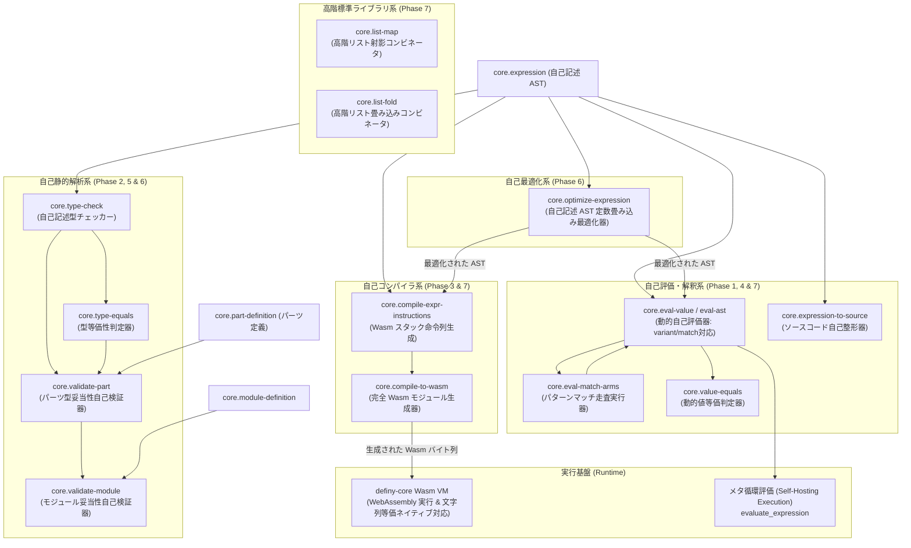

# definy のセルフホスト構想 (Self-Hosting)

definy を definy
自身の言語仕様・データ構造・評価器を用いて表現し、自己記述・自己検証可能にするための設計と実装仕様。

## 概要

definy
は、構文木（AST）、型システム、パーツやモジュールのメタデータ、そしてそれらの評価器・型チェッカー・コンパイラを
definy
の純粋なデータ構造および式（`Expression`）として自己記述できるセルフホスト環境を実現しています。

これにより、以下の利点が得られます：

1. **コンパイラ・評価器の完全自己完結**:
   外部言語（Rustなど）の変更なしに、definy 言語自体の新機能や最適化を definy
   内で記述・検証可能。
2. **決定論的かつコンテンツ指向の言語定義**: 式や型、モジュール構造自体が
   SHA-256 / Ed25519
   によるコンテンツ指向ハッシュで管理され、バージョンロックと不変性が保証される。
3. **安全なマクロ・メタプログラミング**:
   式をデータとして受け取り、式を返す関数を通常パーツとして安全に定義可能。
4. **自己ホスト WebAssembly 生成**: definy 式から WebAssembly
   バイナリを直接生成でき、外部コンパイラなしでネイティブ/ブラウザ実行可能。

### セルフホスティング全体アーキテクチャ



---

## セルフホストのロードマップと到達状況

- [x] **Phase 1: 完全動的値評価器 (Self-Evaluating Interpreter)**
  - 動的値型 `core.value`、変数環境型 `core.env`、環境探索
    `core.env-lookup`、環境拡張 `core.env-extend`
  - 完全動的値自己評価器 `core.eval-value`: `expression -> env -> value`
- [x] **Phase 2: 自己記述型チェッカー (Self-Hosted Type Checker)**
  - 型エラー型 `core.type-error`、型検査結果型 `core.type-result`、型環境
    `core.type-env`
  - 型等価性判定 `core.type-equals`
  - 静的型検査器 `core.type-check`: `expression -> type-env -> type-result`
- [x] **Phase 3: 自己ホスト WebAssembly コンパイラ (Self-Hosted Wasm Compiler)**
  - 式スタック命令列コンパイラ `core.compile-expr-instructions`:
    `expression -> list<number>`
  - 完全 WebAssembly バイナリ生成器 `core.compile-to-wasm`:
    `expression -> list<number>`
  - definy の Wasm VM による即時実行・検証を実証完了
- [x] **Phase 4: 自己記述フォーマッター・メタ循環評価 (Self-Hosted Formatter &
      Meta-Circular Execution)**
  - 自己記述コード整形器 `core.expression-to-source`: `expression -> string`
  - 構文拡張: `let`, `not`, `and`, `or` の完全自己評価 (`core.eval-value`) &
    型検査 (`core.type-check`)
- [x] **Phase 5: パーツ自己検証器 & 完全自己ホストコンパイル実証
      (Self-Validation & End-to-End Compiler Execution)**
  - パーツ妥当性自己検証器 `core.validate-part`: `part-definition -> boolean`
  - Wasm 命令列コンパイラ `core.compile-expr-instructions` の論理演算（`not`,
    `and`, `or`）対応
  - 自己記述コンパイラ `core.compile-to-wasm` による Wasm
    生成・即時実行の実証完了
  - 汎用自己評価器 `core.eval-value`、自己型チェッカー
    `core.type-check`、自己バリデータ `core.validate-part` のメタ循環実証完了
- [x] **Phase 6: 自己記述 AST 最適化器 & モジュール全体自己検証 (Self-Hosted
      Optimizer & Module Validation)**
  - 自己記述 AST 最適化器 `core.optimize-expression`: `expression -> expression`
    - 定数畳み込み（Constant Folding: 算術演算、論理否定、条件分岐の枝刈り）
    - 最適化された AST からの Wasm 生成 & 即時実行実証完了
  - モジュール妥当性自己検証器 `core.validate-module`:
    `module-definition -> boolean`
    - モジュール名検証（非空文字チェック）および全パーツの型妥当性の網羅検証実証完了
- [x] **Phase 7: 直和型・パターンマッチ自己評価 & 動的等価判定 &
      高階コレクションコンビネータ (Self-Hosted ADT Pattern Matching &
      Collections)**
  - Wasm コンパイラでのディープ文字列等価比較ネイティブ対応（`Expression::Equal`
    / `Expression::NotEqual` で Tag 2: String のバイト列比較ディスパッチ）
  - 動的値等価性自己判定器 `core.value-equals`: `value -> value -> boolean`
  - 直和型構築 `variant` 式の自己解釈実行（`core.eval-value`）
  - パターンマッチ `match` 式の完全自己解釈実行（`core.eval-match-arms`,
    `core.eval-match-arms-inner`
    による先頭からの線形マッチと拡張環境上での本体評価）
  - 高階リスト操作コンビネータ `core.list-map`:
    `(a -> b) -> list<a> -> list<b>`、`core.list-fold`:
    `(b -> a -> b) -> b -> list<a> -> b`
  - メタ循環パターンマッチ実行および高階リスト処理の実行実証完了

---

## セルフホスト用ビルトインパーツ (`core` モジュール)

### Phase 1: 動的値・環境と完全評価器

#### 1. 動的値型: `core.value`

ランタイム実行時の動的値を表現する直和型（Union Type）。

- `number(value: number)`: 数値
- `string(value: string)`: 文字列
- `boolean(value: boolean)`: 真偽値
- `list(value: list<value>)`: リスト値
- `closure({ parameter_id: number, body: expression, captured_env: env })`:
  レキシカルスコープを保持する関数クロージャ
- `variant({ tag: string, payload: value })`: タグ付き直和型値
- `unit`: 空値

#### 2. 変数環境型 & 補助関数: `core.env`, `core.env-lookup`, `core.env-extend`

- `core.env`: `list<{ variable_id: number, value: value }>`
- `core.env-lookup`:
  `env -> variable_id -> value`（環境の末尾から最新の束縛を線形探索）
- `core.env-extend`:
  `env -> variable_id -> value -> env`（環境の末尾に新しい変数値を追加）

#### 3. 完全動的値評価器: `core.eval-value`

```definy
eval-value: expression -> env -> value
```

- リテラル（数値・文字列・真偽値）、算術演算（`add`, `subtract`, `multiply`,
  `divide`, `remainder`）、等価比較（`equal`）、小なり比較（`less_than`）
- レキシカルスコープ環境による変数解決（`variable`）
- 条件分岐（`if`）
- 関数定義時における環境キャプチャ（クロージャ生成）
- 関数呼び出し（`call`）時におけるキャプチャ環境の復元と引数束縛

---

### Phase 2: 自己記述型チェッカー

#### 1. 型エラー型 & 結果型: `core.type-error`, `core.type-result`

- `core.type-error`:
  - `type_mismatch({ expected: type-ast, actual: type-ast })`: 型の不一致
  - `undefined_variable({ variable_id: number })`: 未定義の変数参照
  - `condition_not_boolean({ actual: type-ast })`: 条件式の型が boolean 以外
  - `unknown_error`: 未知のエラー
- `core.type-result`: `ok(type-ast) | error(type-error)`

#### 2. 型環境型: `core.type-env`, `core.type-env-lookup`, `core.type-env-extend`

- `core.type-env`: `list<{ variable_id: number, var_type: type-ast }>`
- 静的スコープにおける変数の型を追跡。

#### 3. 型等価性判定: `core.type-equals`

```definy
type-equals: type-ast -> type-ast -> boolean
```

2つの `type-ast` が同一の型であるかを再帰的に判定。

#### 4. 静的型チェッカー: `core.type-check`

```definy
type-check: expression -> type-env -> type-result
```

definy の式 AST
を静的に走査し、型安全性を検証して最終的な型または詳細な型エラーを返却。

---

### Phase 3: 自己ホスト WebAssembly コンパイラ

#### 1. スタックマシン命令列コンパイラ: `core.compile-expr-instructions`

```definy
compile-expr-instructions: expression -> list<number>
```

式 AST を WebAssembly
のバイトコード命令列（`list<number>`）へ再帰的に変換します。

- `number`: `i64.const` (`0x42`) + LEB128 エンコードバイト列
- `add`: 左辺命令列 + 右辺命令列 + `i64.add` (`0x7c`)
- `subtract`: 左辺命令列 + 右辺命令列 + `i64.sub` (`0x7d`)
- `multiply`: 左辺命令列 + 右辺命令列 + `i64.mul` (`0x7e`)
- `divide`: 左辺命令列 + 右辺命令列 + `i64.div_s` (`0x7f`)
- `equal`: 左辺命令列 + 右辺命令列 + `i64.eq` (`0x51`)
- `less_than`: 左辺命令列 + 右辺命令列 + `i64.lt_s` (`0x53`)

#### 2. 完全 Wasm モジュール生成器: `core.compile-to-wasm`

```definy
compile-to-wasm: expression -> list<number>
```

スタック命令列をラップし、完全で実行可能な WebAssembly
バイナリ（`list<number>`）を組み立てて出力します。

出力されるバイナリ構造：

1. **Magic Header** (8 bytes): `\0asm` (`[0x00, 0x61, 0x73, 0x6d]`) + Version 1
   (`[0x01, 0x00, 0x00, 0x00]`)
2. **Type Section** (Section 1): 1 つの関数シグネチャ `() -> i64`
3. **Function Section** (Section 3): Type 0 を参照する 1 つの関数
4. **Export Section** (Section 7): 関数 0 を `"main"` としてエクスポート
5. **Code Section** (Section 10): ローカル変数定義（0個）+
   コンパイルされたスタック命令列 + `end` (`0x0b`)

生成されたバイト列は、definy の Wasm VM およびブラウザの
`WebAssembly.instantiate` で即座にロード・実行できます。

---

### Phase 4: 自己記述フォーマッターとメタ循環評価

#### 1. 式 AST コード整形器: `core.expression-to-source`

```definy
expression-to-source: expression -> string
```

definy の式
AST（`core.expression`）を受け取り、対応するソースコード文字列（`string`）を再帰的に組み立てて出力する純粋な
definy パーツ。

- `number`: `"<number>"`
- `string`: 文字列リテラルそのもの
- `boolean`: `"true"` または `"false"`
- `add`, `subtract`, `multiply`, `divide`, `remainder`:
  括弧と二項演算子記号付き文字列（例: `"((a + b) * c)"`）
- `equal`, `less_than`: 比較式文字列（例: `"(a < b)"`）
- `and`, `or`: 論理結合文字列（例: `"(a && b)"`）
- `not`: 単項否定文字列（例: `"!a"`）
- `if`: `"if (cond) then then_expr else else_expr"`
- `call`: `"fn(arg)"`
- `variable`: 変数参照文字列

#### 2. メタ循環評価 (Meta-Circular Evaluation) 実証

definy 式として記述された評価器・フォーマッターパーツは、definy の WebAssembly
実行基盤（`definy-core`）上で直接実行・検証されています。

- `test_self_hosted_meta_circular_eval_ast_execution`: `core.eval-ast`
  パーツに多項式 AST `(100 - (10 * 3)) + (50 / 2)` を与えて実行し、自己評価結果
  `95` を実証。
- `test_self_hosted_expression_to_source_execution`: `core.expression-to-source`
  パーツに `10 + 20` の AST を与えて実行し、自己整形結果
  `"((<number> + <number>))"` を実証。

---

### Phase 5: パーツ自己検証器 & 完全自己ホストコンパイル実証

#### 1. パーツ妥当性自己検証器: `core.validate-part`

```definy
validate-part: part-definition -> boolean
```

definy
のパーツ定義メタデータ（`core.part-definition`）を受け取り、そのパーツの式（`expression`）が自己記述型チェッカー（`core.type-check`）によって推論された型と、パーツの宣言型（`part_type`）が
`core.type-equals` で一致するかを判定する自己完結バリデータ。

- 入力パーツの式を空の型環境（`[]`）で静的型検査
- 型検査が `ok(inferred_type)` の場合、宣言型との等価性を `type-equals` で判定
- 型不一致または型エラーの場合は `false` を返却

---

### Phase 6: 自己記述 AST 最適化器 & モジュール全体自己検証

#### 1. 自己記述 AST 最適化器: `core.optimize-expression`

```definy
optimize-expression: expression -> expression
```

definy の式
AST（`core.expression`）を受け取り、定数同士の計算を事前に計算して置き換える「定数畳み込み（Constant
Folding）」および不要な分岐の枝刈り（Dead Code
Elimination）を行う純粋な最適化パーツ。

- `add(number(a), number(b))` => `number(a + b)`
- `subtract(number(a), number(b))` => `number(a - b)`
- `multiply(number(a), number(b))` => `number(a * b)`
- `not(boolean(b))` => `boolean(!b)`
- `if({ condition: boolean(true), then_expr, else_expr })` =>
  `optimize(then_expr)`
- `if({ condition: boolean(false), then_expr, else_expr })` =>
  `optimize(else_expr)`

最適化された AST は、`core.compile-to-wasm`
を介して単一の定数命令（`i64.const 42`）などに凝縮され、WebAssembly
バイトコードサイズの縮小と実行高速化をセルフホスト自身で実現します。

#### 2. モジュール妥当性自己検証器: `core.validate-module`

```definy
validate-module: module-definition -> boolean
```

モジュール定義（`core.module-definition`）を受け取り、モジュール名が非空文字（`string-length > 0`）であること、および構成パーツが
`core.validate-part` による型妥当性を満たすかを網羅的に検証します。

---

### 完全自己ホストコンパイル & メタ循環実行の実証

definy
のテストスイート（`definy-server/src/self_hosting_tests/`）において、以下の
end-to-end メタ循環実行がすべて実証されています。 テストコードは責務に応じて
`ast_structure_tests.rs`（静的構造検証）と
`execution_tests.rs`（動的実行実証）、および共通ヘルパー `helpers.rs`
に分割・整理されています。

| テスト関数名                                              | 検証対象パーツ                                      | 入力・実行内容                                                  | 実証された結果                             |
| :-------------------------------------------------------- | :-------------------------------------------------- | :-------------------------------------------------------------- | :----------------------------------------- |
| `test_self_hosted_meta_circular_eval_ast_execution`       | `core.eval-ast`                                     | 多項式 AST `(100 - (10 * 3)) + (50 / 2)`                        | 自己評価値 `95`                            |
| `test_self_hosted_expression_to_source_execution`         | `core.expression-to-source`                         | 加算式 AST `add(10, 20)`                                        | 整形文字列 `"((<number> + <number>))"`     |
| `test_self_hosted_meta_circular_eval_value_execution`     | `core.eval-value`                                   | 加算式 AST `add(10, 25)` と空環境 `[]`                          | 動的値 `number(35)`                        |
| `test_self_hosted_type_checker_execution`                 | `core.type-check`                                   | 加算式 AST `add(10, 20)` と空型環境 `[]`                        | 型推論結果 `ok(number)`                    |
| `test_self_hosted_validate_part_execution`                | `core.validate-part`                                | 正常なパーツ定義 `{ name, type: number, expr: 10 + 20 }`        | 判定結果 `true`                            |
| `test_self_hosted_validate_module_execution`              | `core.validate-module`                              | 正常なモジュール定義（`true`）と空名不正モジュール（`false`）   | 判定結果 `true` / `false`                  |
| `test_self_hosted_compile_to_wasm_execution`              | `core.compile-to-wasm`                              | 式 `15 + 27` から自己ホストで Wasm バイナリを生成               | 生成された Wasm を VM で実行し `42` を算出 |
| `test_self_hosted_optimize_expression_execution`          | `core.optimize-expression` + `core.compile-to-wasm` | 多項式 `(10 * 3) + 12` を `42` に定数畳み込み最適化し Wasm 生成 | 最適化された Wasm を実行し `42` を算出     |
| `test_self_hosted_value_equals_execution`                 | `core.value-equals`                                 | 数値・文字列・真偽値の動的値等価比較                            | 判定結果 `true` / `false`                  |
| `test_self_hosted_eval_value_variant_and_match_execution` | `core.eval-value` + `core.eval-match-arms`          | AST `match variant("some", 42) { some(x) => x + 8 }`            | パターンマッチ自己実行で `50` を算出       |
| `test_self_hosted_list_map_and_fold_execution`            | `core.list-map` + `core.list-fold`                  | `map (*2) [1,2,3]` および `fold (+) 0 [10,20,30]`               | `[2, 4, 6]` および `60` を算出             |

---

## 実装アーキテクチャとノウハウ

### 1. 型チェッカーにおける同種二項演算の共通化 (`binary_typed_op`)

自己記述型チェッカー（`core.type-check`）では、算術演算（`add`, `subtract`,
`multiply`, `divide`, `remainder`）と論理結合（`and`,
`or`）が「左辺と右辺が同じ期待型であることを要求し、同じ型を返す」という共通の検査パターンを持ちます。
内部で高階ファクトリクロージャ `binary_typed_op`
を導入することで、型規則の直交性を保ちながらコード重複（DRY）を解消しています：

```rust
let binary_num_op = |tag, check_hash, var_id| {
    binary_typed_op(tag, check_hash, var_id, type_num)
};
let binary_bool_op = |tag, check_hash, var_id| {
    binary_typed_op(tag, check_hash, var_id, type_bool)
};
```

### 2. テストスイートのモジュール分割と DRY 化

セルフホスティングのテストが 1000
行近くに達した際、以下の設計方針で分割・整理を行いました：

- **`helpers.rs`**:
  テスト用アカウント生成（`get_test_account_and_mod_id`）、イベントコミット生成（`create_test_module_events`）、AST
  構築簡易ヘルパー（`ast_num`,
  `ast_add`）、パーツ呼び出しビルダー（`call_part1`, `call_part2`,
  `call_part3`）、および Wasm
  バイト列抽出ヘルパー（`value_list_to_u8_vec`）を集約。型エイリアス
  `TestEvents` によりシグネチャの複雑さを抑制。
- **`ast_structure_tests.rs`**:
  ビルトインパーツの登録、および各パーツの式が意図通りの
  AST（パターンマッチ分岐やタグの網羅性）を持つことを検証。
- **`execution_tests.rs`**: 実際にパーツを definy
  実行系に登録し、メタ循環評価を実行して期待通りの値が返ることを実証。

### 3. 自己評価器（`builtin_evaluator`）の責任分割サブモジュール化

動的値評価器 `core.eval-value` は、多数の構文式に対する評価分岐（Match
Arms）を持つため、単一ファイル（約 950 行）から以下の 5
つのサブモジュールへ責任を分割しました：

- **`mod.rs`**: エントリポイント `create_eval_value_part`。各アームを集約して
  `core.eval-value` パーツを構成。
- **`helpers.rs`**: AST 再帰評価 `eval_sub` や、動的値生成関数群（`val_num`,
  `val_str`, `val_bool`, `val_variant`, `val_unit`）を定義。
- **`arith_arms.rs`**: 算術演算・比較演算（`add`, `subtract`, `multiply`,
  `divide`, `remainder`, `equal`, `less_than`）の評価分岐。
- **`logical_arms.rs`**: 論理演算（`not`, `and`,
  `or`）の短絡評価を含む評価分岐。
- **`control_arms.rs`**: 制御構文・バリアント・マッチ（`variable`, `if`,
  `function`, `call`, `let`, `variant`, `match`）の評価分岐。

### 4. 動的値等価判定器（`builtin_value_type`）の二重 Match 共通化

プリミティブ値（数値、文字列、真偽値）の等価判定では、2 つの `core.value`
を連続マッチして同種バリアントであることを確認する構造が反復するため、`primitive_eq_arm`
クロージャを導入してパターンを共通化し、コード行数を約 80 行削減しました。

---

## 既存の型定義・AST・標準ライブラリ

### 1. 式 AST: `core.expression`

definy の全計算式を表現する直和型。

### 2. 型 AST: `core.type-ast`

`number`, `string`, `boolean`, `list`, `function`, `record`, `union`,
`reference` を表現する直和型。

### 3. パーツ定義 & モジュール定義: `core.part-definition`, `core.module-definition`

メタデータ（名前、説明、型、式）をコンテンツ指向で保持するレコード型。

### 4. 標準ライブラリ (`std` モジュール)

- `abs`: `number -> number`
- `min`, `max`: `number -> number -> number`
- `sign`: `number -> number`
- `bool-to-string`: `boolean -> string`
- `list-is-empty`: `list<T> -> boolean`
- `list-head`: `list<T> -> T`
