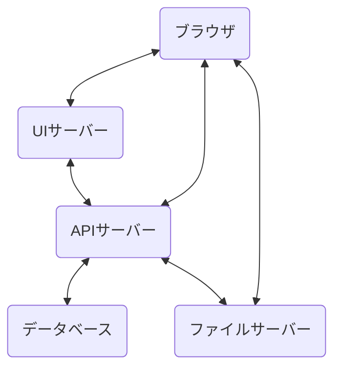

# サーバーの構成

原理的には 1つのHTTPサーバーで提供できるようにする構造だが,
クラウドの得意な分野的に分かれているのを活かすために複数のSaaSを使います

### UIサーバー

UIサーバーはHTMLを返すサーバー. ブラウザでの操作UIを提供する

使用SaaS: Deno Deploy

### ファイルサーバー

ファイルを保存して, 配信するサーバー

使用SaaS: Cloudflare R2

## APIサーバー

APIサーバーはデータを受け取って処理をするサーバー

使用SaaS: Deno Deploy

### データベース

イベントの検索向けのデータ保存と, IPアドレス, ログを保存する場所
APIサーバーと通信する

使用SaaS: SurrealDB Cloud

