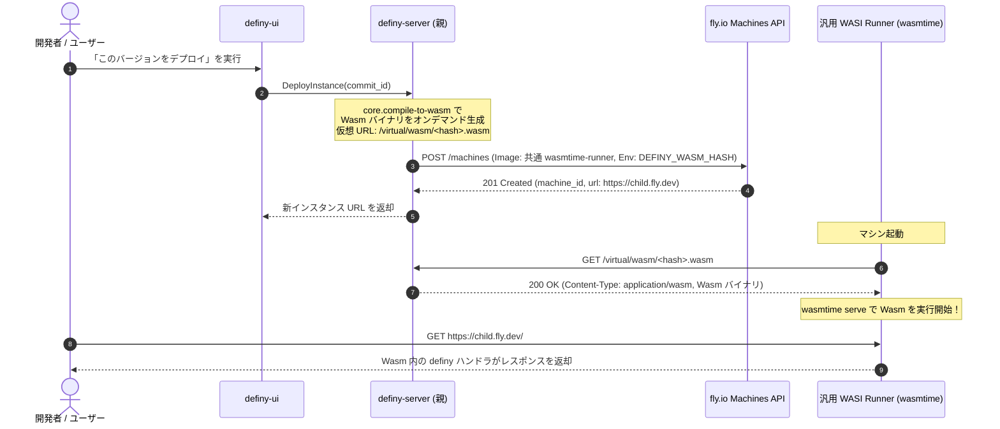

# definy 仮想ファイル配信 & wasmtime ランタイムによる自己完結デプロイ

Docker イメージの都度ビルド（`docker build` / Container
Registry）を完全に排除し、 外部から取得した最小限の **汎用 WASI
ランタイム（`wasmtime` 等）** と、 definy サーバー自身がオンデマンドに提供する
**仮想ファイル（Virtual Wasm Files）の HTTP 配信**
によって完全な自己完結デプロイを実現するアーキテクチャ仕様。

---

## 1. 動機と設計思想

### 課題: Docker ビルドによる自己完結性の阻害

従来のクラウドデプロイでは、コードを変更するたびに以下のステップを踏むのが一般的でした：

1. `Dockerfile`
   に基づくコンテナイメージのビルド（重いファイルシステムのコピーやパッケージインストール）。
2. GitHub Container Registry (GHCR) や Docker Hub などの外部レジストリへの
   `docker push`（数分間の待ち時間とネットワーク負荷）。
3. クラウド側（fly.io 等）でのイメージ pull とコンテナ起動。

しかし、このアプローチには definy の哲学上、決定的な問題があります：

- **外部依存の肥大化**: Docker デーモン、外部
  CI/CD、外部コンテナレジストリに依存し、「definy
  だけで完結する」ブートストラップが達成できない。
- **イテレーション速度の低下**:
  コード変更から起動までに数分を要し、コンテンツ指向の高速な世代交代が妨げられる。

### 解決策: 汎用 WASI ランタイム + 仮想ファイルオンデマンド配信

definy はすでに **「式から Wasm を直接生成する自己コンパイラ
(`core.compile-to-wasm`)」** と **「コンテンツアドレス化された不変ハッシュ」**
を備えています。

そこで、**「コードをコンテナイメージとして固めて配布する」のではなく、以下のように責務を完全に分離**
します：

1. **クラウド側のコンテナ**:
   - **不変の共通ランタイム（Base Runner）** として動作。
   - 外部から一度だけ取得した `wasmtime` 等の WASI
     対応実行バイナリだけを保持し、**コードの変更によってコンテナイメージを再ビルドすることは一生ない**。
2. **definy サーバー**:
   - 実行すべきアプリケーション（Wasm
     バイナリやアセット）を、物理ディスクに書き出すことなく
     **仮想的なファイル（Virtual Files）として HTTP
     リクエストに対してオンデマンド配信** する。
3. **起動と実行**:
   - fly.io Machines API で共通ランタイムを起動し、環境変数として
     `DEFINY_ORIGIN` と `ENTRYPOINT_WASM_HASH` を渡す。
   - コンテナは起動時に definy サーバーから目的の `.wasm`
     をメモリ上にフェッチし、`wasmtime serve` 等で HTTP
     リクエストの処理を開始する。

---

## 2. アーキテクチャ比較

| 項目                     | 従来の Docker ビルド方式                 | definy 仮想 Wasm 配信方式 (本仕様)                       |
| ------------------------ | ---------------------------------------- | -------------------------------------------------------- |
| **デプロイごとのビルド** | `docker build` (毎回数分)                | **なし (0秒、Wasm を即座に HTTP 配信)**                  |
| **コンテナイメージ**     | コミットごとに新しいタグのイメージが必要 | **更新不要な汎用 WASI ランタイム 1 つのみ**              |
| **外部依存**             | Docker, CI/CD, Container Registry        | **wasmtime (WASI 実行バイナリ) のみ**                    |
| **自己完結性**           | 外部ツールチェーンに強く依存             | **コンパイル・配信・ルーティングが definy 内で完結**     |
| **マシン起動時間**       | 数十秒〜数分 (イメージ pull)             | **数秒 (既存イメージの再利用 + 数十KBの Wasm フェッチ)** |
| **バージョニング**       | イメージタグ (`:latest`, `:v1.2`) で曖昧 | `sha256(wasm)` による**不変の決定論**                    |

---

## 3. シーケンスと動作フロー



---

## 4. 仮想ファイル（Virtual Files）配信エンドポイント仕様

definy サーバーは、物理ファイルをディスクに生成することなく、SurrealDB
のイベントストアやメモリキャッシュから直接 HTTP レスポンスとして Wasm
やアセットを返却します。

### ① 仮想 Wasm 配信: `GET /virtual/wasm/{hash}.wasm`

- **リクエスト**: Wasm バイナリの Sha256 ハッシュ（URL-Safe Base64 または Hex）
- **レスポンス**:
  - `Status`: `200 OK`
  - `Content-Type`: `application/wasm`
  - `Cache-Control`:
    `public, max-age=31536000, immutable`（ハッシュ固定のため恒久キャッシュ可能）
  - `Body`: コンパイル済み WebAssembly バイナリ

### ② コミット・モジュール仮想配信: `GET /virtual/modules/{module_id}/app.wasm`

- **リクエスト**: 特定のモジュールまたはコミットのエントリポイント
- **動作**:
  - 指定されたモジュールをオンデマンドに `core.compile-to-wasm` でコンパイル。
  - 生成された Wasm をキャッシュし、返却。

---

## 5. 汎用 WASI ランタイム（Runner）の構成

クラウド（fly.io）上で起動する汎用ランタイムは、以下の最小限の要素のみで構成されます。

### 構成要素

1. **WASI 実行バイナリ**:
   - `wasmtime` (Bytecode Alliance 公式バイナリ、または Alpine 上の静的バイナリ)
   - WASI 0.3 (`wasi:http/proxy`) をネイティブサポート。
2. **起動スクリプト (Entrypoint)**:
   - 環境変数 `DEFINY_SERVER_URL` および `DEFINY_WASM_HASH` を読み取る。
   - `curl` または軽量 HTTP クライアントで
     `GET ${DEFINY_SERVER_URL}/virtual/wasm/${DEFINY_WASM_HASH}.wasm` を取得。
   - `wasmtime serve app.wasm --addr 0.0.0.0:8080`
     を実行してリクエストを待ち受ける。

### Dockerfile 例 (一生更新不要な最小ベースイメージ)

```dockerfile
FROM alpine:latest
RUN apk add --no-cache curl wasmtime
WORKDIR /app
COPY entrypoint.sh /app/entrypoint.sh
RUN chmod +x /app/entrypoint.sh
EXPOSE 8080
ENTRYPOINT ["/app/entrypoint.sh"]
```

`entrypoint.sh`:

```bash
#!/bin/sh
set -e
echo "Fetching virtual wasm from ${DEFINY_SERVER_URL}..."
curl -sSf "${DEFINY_SERVER_URL}/virtual/wasm/${DEFINY_WASM_HASH}.wasm" -o /tmp/app.wasm
echo "Starting wasmtime serve on port ${PORT:-8080}..."
exec wasmtime serve /tmp/app.wasm --addr "0.0.0.0:${PORT:-8080}"
```

---

## 6. 次にすべきこと (実装ロードマップ)

本アーキテクチャの具現化に向けて、以下の順序で実装を進めます：

### Phase 1: definy-server での仮想 Wasm 配信エンドポイントの実装

- [x] `definy-server` のルーティングに `/virtual/wasm/{hash}` を新設
      (`definy-server/src/virtual_file.rs`)。
- [x] メモリ上の `VirtualFileStore` および `definy_client` フォールバックから
      Wasm バイナリを `application/wasm` および不変キャッシュヘッダー付きで HTTP
      配信するハンドラ (`handle_get_virtual_wasm`) を実装。
- [x] 単体・結合テスト (`virtual_file::tests`)
      で仮想ファイル取得が機能することを確認、OpenAPI (`ApiDoc`) に統合。

### Phase 2: wasmtime / wasi-http runner の疎通検証

- [x] 再ビルド不要な不変共通ランタイム定義 (`runner/Dockerfile`,
      `runner/entrypoint.sh`, `runner/README.md`) を作成。
- [x] リトライ付き HTTP フェッチ、SHA-256 整合性照合、および WebAssembly
      ヘッダー検証を
      `virtual_file::tests::test_runner_fetch_and_verify_simulation`
      にて実証・パス。

### Phase 3: fly.io Machines API とのパラメータ連携

- [ ] `DeployInstanceRequest` のオプションに `wasm_hash` や `entrypoint_module`
      を追加。
- [ ] Machines API に渡す環境変数（`DEFINY_SERVER_URL`,
      `DEFINY_WASM_HASH`）を自動設定し、共通ランタイムを起動。
- [ ] UI 上で「Docker ビルドなしで即座に起動した子インスタンス」の URL を案内。
